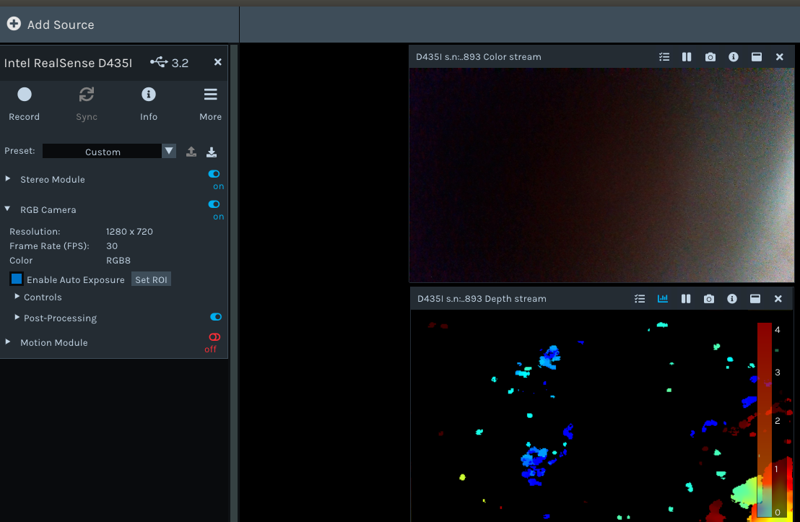

前置
- usb 3.0 [[interface]]
- 我的设备：Intel RealSense D435I（可能其他设备步骤也相同）
  - 原理介绍：https://blog.csdn.net/lemonxiaoxiao/article/details/109297834
  - 这是深度相机，可能得到点云[[pointcloud/basics]]

过程
- [安装文档](https://github.com/IntelRealSense/librealsense/blob/master/doc/installation.md)
注意不要全听，参考[[read-doc]]
    - 比如`upgrade`是很危险的，参考[[software-management/upgrade]]
    - 比如Build and apply patched kernel modules这步其实略过也可以
      - 而且有些时候，可能跑不通这部分。那就直接算了

懒人总结版
- 先拔相机
- 逐行运行这几行脚本（Ubuntu 18.04）
  - 给强迫症：源码clone到哪？可以和[[libfranka]]类似，到`/usr/local/src`等等
```sh
sudo git clone https://github.com/IntelRealSense/librealsense.git
sudo apt-get install git libssl-dev libusb-1.0-0-dev libudev-dev pkg-config libgtk-3-dev
sudo apt-get install libglfw3-dev libgl1-mesa-dev libglu1-mesa-dev at
cd librealsense
./scripts/setup_udev_rules.sh
sudo mkdir build && cd build
sudo cmake ../ -DBUILD_EXAMPLES=true
sudo make -j8
sudo make install
```
- `-D`命令怎么选参考[文档](https://github.com/IntelRealSense/librealsense/blob/master/doc/installation.md)
  - 参考[[cmake]]，[[make]]
- 测试命令：`realsense-viewer`
  - 弹出GUI中左侧开开关（RGB，Stereo）等试试，可以看到2D，3D图像等
  - 