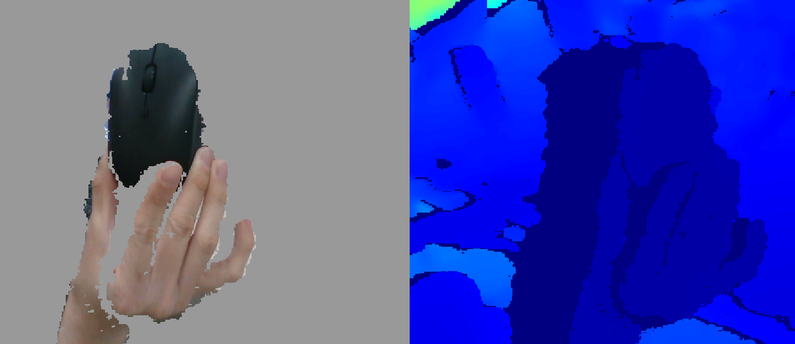

前置：
- [[realsense/installation]]

步骤：
https://pypi.org/project/pyrealsense2/
- 举例：如果你有[[conda-installation]]的话，可以
  - `conda create -n realsense python=3.6`
  - `conda activate realsense`
  - `pip install pyrealsense2`

- 然后官网示例
```sh
import pyrealsense2 as rs
pipe = rs.pipeline()
profile = pipe.start()
try:
  for i in range(0, 100):
    frames = pipe.wait_for_frames()
    for f in frames:
      print(f.profile)
finally:
    pipe.stop()
```
- 进一步看
https://github.com/IntelRealSense/librealsense/blob/master/wrappers/python/examples/
就知道怎么用了
- 本文件夹中`python-examples/align-depth2color.py`
  - 需要`pip install opencv-python`
  - 把`clipping_distance_in_meters`改掉，效果拔群！
    - 比如设为`0.4`
    - 然后把其它东西放远，左侧看到全灰
    - 然后手拿鼠标凑近试试，
  - 注意：`0.4`意思是超过的部分都被忽略作为背景
    - 但是你太近了它也识别不到！
    - 前后动一动才能找到效果最好的状态
  - 透明的水杯什么的会比较难测量深度
- 本文件夹中`python-examples/export_ply_example.py`
  - 直接输出`.ply`（是特殊文本文件）
  - 注意拷过来才能用（否则在`/usr/local`这种地方可能没权限）
    - 这个玩意没权限也不报错，太屑了
    - 这又是[[leaky-abstraction]]的例子
  - 注：效果不如[[realsense/installation]]中`realsense-viewer`导出效果好