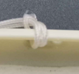
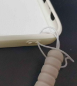

- 摔地上碎了：换外屏
  - 防止方法
    - 钢化膜
      - 但钢化膜也有坏处
        - 太厚
        - 钢化膜本身非常脆弱易碎（比屏幕易碎多了），一碎很容易出现裂痕
          - 容易导致屏幕很难看（丢了面子保了里子）
          - 且硌手
    - 有手指拉环的手机壳
      - 先根据手机型号买带拉环手机壳
      - 找合适位置的孔
      - 将细线穿进孔并打结，效果
        - 注意此图细线头部有比细线还细的透明丝线，是一种[[temp-solution]]，先临时穿进一点点方便用手拎起来
        - 怎么打结？参考
    - 两者可以一起用
- 进水出竖线：可能要换内屏，更贵
- 换屏不是原装可能导致问题（比如太暗）。所以尽量保护好屏幕！