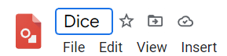
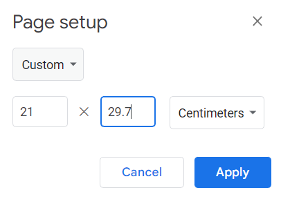
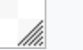
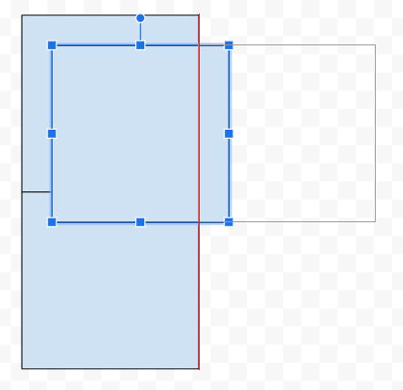
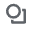
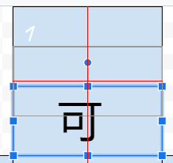
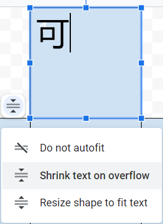
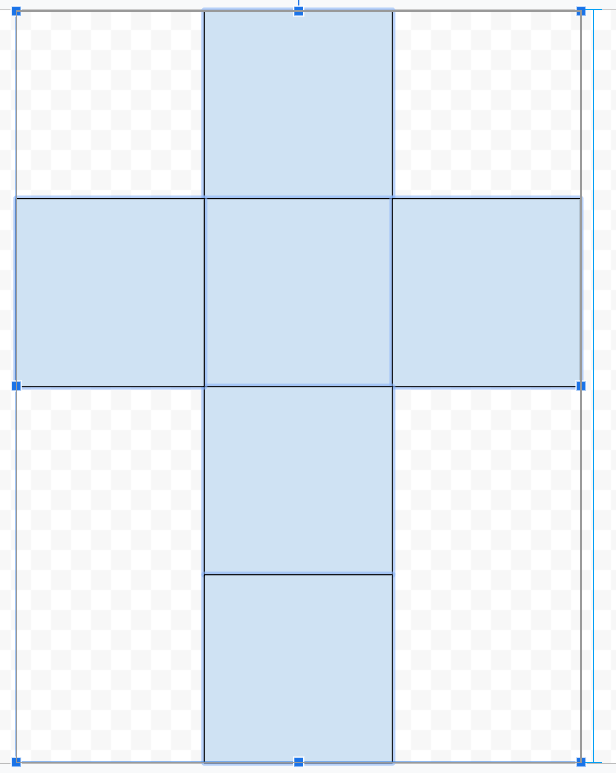

前置：
- [[google]]账号
  - 注册时可能需要[[sms]]

内容：
- [官网](https://docs.google.com/drawings)，需要登录账号
## 文件操作
- `File`，可以导出`.svg`矢量图，`.jpg`，`.pdf`等
- 左上角改名
- 无需保存，关闭时自动留在google drive，下次`File - Open`即可
- `File - Page setup`可以设置大小，比如A4纸：
- 右下角拖动也可改变大小
## 绘图基础操作
- 
  - shape按钮，傻瓜操作
  - 如按住`Shift`可以画正方形
  - 尝试复制粘贴出相同的正方形，拖动时自动对齐
- 
  - 文本框也可以对齐（上图是居中对齐）
  - 也可以选择文字和框一样大（在此状态增大文字，让文字大小overflow就行）：
- 
  - 选中并缩放：`Shift`保持比例，也有对齐功能
  - 上方的圆形按钮用于旋转。整数度（如180度）有磁吸