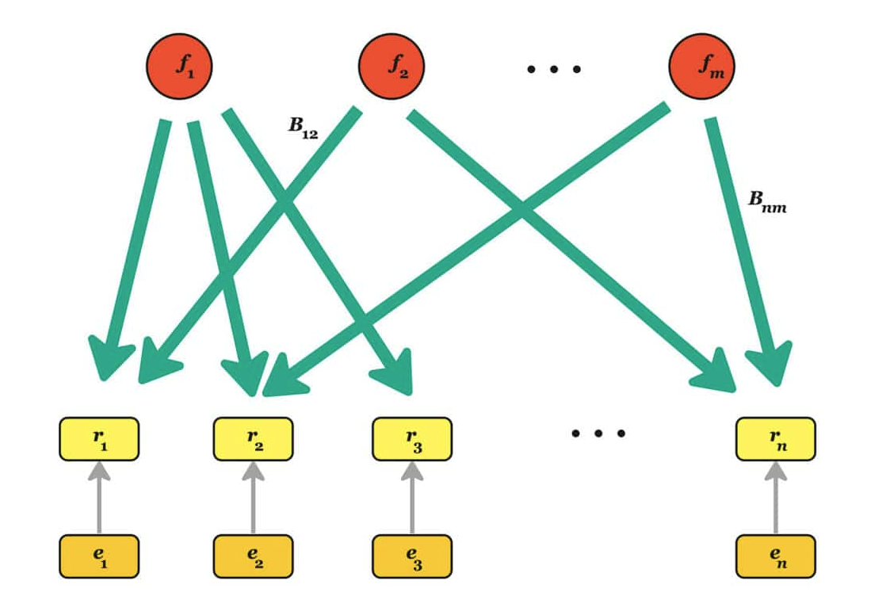

- 参考
  - [[factor-exposure]]
  - [[multi-ary]]
- [HRT博客](https://www.hudsonrivertrading.com/hrtbeat/modeling-equities-returns/)
- $r_t = B_t f_t + \epsilon_t$
  - $f_t$是factor returns，随时间变化
  - $B_t$是[[factor-exposure]]
  - $\epsilon_t$是噪声[[data-science/residual]]
- 
- `in a crisis all correlations go to 1`
  - 意思是一些$f_t$疯狂动，噪声$\epsilon_t$被掩盖，更多东西可解释
  - 参考[[SNR]], [[cov#corr]]