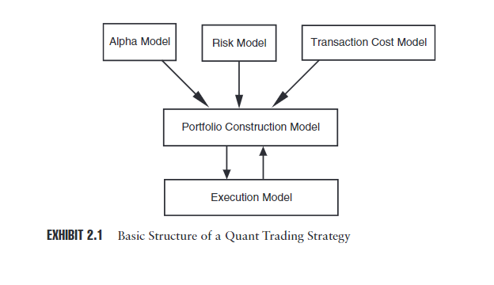

- black box: `some simple input is rigorously tortured to arrive at a mysterious and distant output`
- `for the most part, quantitative trading strategies are in fact clear boxes that are far easier to understand in most respects than the caprice inherent to most human decision making`
- `stat arbitrage`统计套利：两个类似物如果diverge了，迟早要converge
  - 所以quant并不神秘，本质思想都是很简单的
- 强调：quant不是robot. 强调：追求$\alpha$
- 电脑忠实追求人的想法，像missile一样：有错误，会累积
- 何时abandom a systematic approach **for** a discretionary one: 一些反常值！比如场外信息
  - `As such, a human can step in and simply remove Merrill from the universe that the computer models see`
  - 否则信息不准，就是garbage in, garbage out
  - 实践：比如有rumor就不要，或者降低比例，杠杆leverage等
- spectrum between完全automated和完全discretionary
  - what position, how much，是否都用quant得到？
  - quasi-quant: winnow筛出小部分，然后加入人的主观
    - 它们用到的技术是“完全”quant的子集，因此are covered implicitly
# typical structure
- 下图包括成品交易系统，不包括开发平台等
- 
  - alpha model：目标：得利，比如往哪
  - risk model：目标：控制风险：比如不能梭哈
  - `small and last only a short while, the transaction cost model might indicate that the cost of entering and exiting the trade is greater than the expected profits from the trend.`
  - 这三部分feed into construction model，得到要hold的新portfolio
  - 完了就容易计算出要做的变化（交易），当然也根据市场流动性，交易的紧要程度等，提高效率降低成本
  - 变种：去掉部分 / 把真实feedback如交易成本反馈进来
  - 总之这个划分大体靠谱（`captures the various discrete functions`）
- 其它部分：data and research
  - research often involves testing and simulation