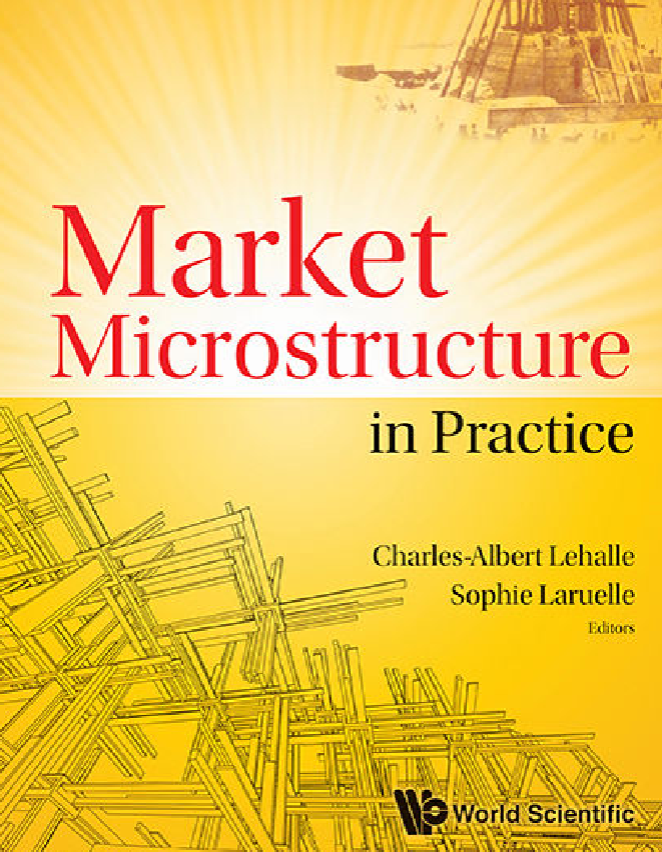

这个文件夹放的是 #读书笔记
主要内容：市场微观结构
注：可以看[[26-intra-day-data]]快速入门一下，大致知道市场微观结构是个啥
- 封面 
- 书名：Market Microstructure in Practice
- ISBN：9789813231122
# Foreword
## 第一个人
- Traditional models of market microstructure have studied the highly simplified interaction between an idealized market-maker or specialist and a stream of external orders that may come from noise traders or informed traders.
  - 几个主体！一句话就说出来了
- 但modern: loosely coupled network of visible and hidden venues, linked together by high-frequency traders and by algorithmic strategies
  - venue此处做“聚点”讲？
  - 没有传统的提供、消耗流动性（market-makers vs. directional traders）的划分，而是不同人的latency, fill prob, cost等属性不同
  - 不是在传统简单结构上叠床架屋，而是直接基础地考察这些
- 市场“进化”（复杂）在equity最显著，原因有size, social prominence as indicators of value, variety of traders等
  - 其它市场（期货）等落后，但大方向是“进化”
  - 所有人包括监管者都想越来越理解市场
- liquidity: 大单怎么能被实际执行
  - 从而出现fragmentation, HFT等话题
  - 作者：交易员、和监管谈笑风生，了解多个利益方
## 2
- secular: 长期，世俗，缓慢……
- lift the obstacle
- 这个人让欧洲更像美国！整个paradigm都变了
- 观察分析理解预判！底层逻辑变化导致order book传递信息变化！
- 从学界找资源，找大佬
## 3
- 哈哈，谢邀！以前经常讨论！
- 举个例子让人们理解：和aviation对比
  - aviation：chief engineer也是test pilot，所以必须负责
- 张三（Mr.Smith）啥也不懂，不知道自己买的价格是哪来的，可能被HFT掠夺，对市场没信心
  - 和航空类比：本来窗户没必要（可以自动驾驶，不太可能对撞。窗户浪费钱）但是没人愿意不公开不透明
- 我们要找回张三的信心！uninformed trader
## 4
- 市场，古老（农贸市场）
- 现在：终端 -> 机器化，亚毫秒级别（人脑100毫秒）
- 这世界变化快，但真的好吗？经济学讲，应该提高资源配置效率，起到价格发现功能
- 主要关注欧洲、实际例子（不过对于全球有参考价值）
- 文学首尾呼应哈哈哈
> In the end, we might have gained from automated markets as costly human intermediaries are replaced by computers. And when a robot monitors the market for us, we will have more time to go out and enjoy the farmer’s market
# Introduction
## Liquidity in Question
- 定性定义：容易买卖
- 流动性风险：涨了卖不出去，然后价格降了
- 为了流动性，牺牲利益（降价卖），改变价格：market impact
- 量化评价流动性：bid-ask spread（粗略，没考虑量）、指定量的round trip cost（即刻买卖的损失）（显然形成一条曲线）
- seeking liquidity需要代价。如大单切小
  - 关注重要点：resilient程度（波动了恢复）
- 一个买单的影响：在其它一群买单中，当然显得明显。在一群卖单中，看不见了。实际中要看平均影响（要看“同时性”，你这个买单和什么东西同时了）
  - market impact和PFP (Price Formation Process)关系：有可能暂时，之后回复。有可能是共识，永久影响
- 所以：理论上，如果同时买卖，就不会有这种临时imbalance引起的波动
  - 不同时，就给了做市商空间
  - 做市商减少波动。承担风险（万一极端单边）
  - 风险和bid-ask spread（流动性）等可以建模给出关系
    - 这时流动性是基本面（风险等）决定的了
- 刚刚说的和实际的区别：首先，流动性不能超过某个风险决定的值有点呃呃；其次，有摩擦问题
  - 交易所垄断导致摩擦：高fee，低质服务。让做市商不来干
  - 所以需要监管（让trading venue竞争！）
  - 结果非常surprising: 流动性的本质变成了fragmentation
- 接下来3章回答关于fragmentation的三个重要问题
- 关注历史，强调方法论！
## Microstructure from a Regulatory Standpoint
- 2005，大变化。监管 -> fragmentation
  - 看[[1-monitor-fragmentation]]的1.2，有许多途径你就可以多线交易以降低成本（spatial fragmentation）
- 新要素：HFT，做市，但无obligation
  - 参考[[16-HFT]]
  - 把传统微观结构模糊了！
- 欧美有各自不同的变化现象
- HFT：让trading venue竞争（且还要流动性）的代价
  - 出现负外部性！本书会question it
  - 呃呃：所以：其它要素愿意出多少钱来“买”流动性就是HFT的价值
  - 比如调整tick size等，就能给HFT定价。有关market design
  - todo：这部分先看到这
## Impact on Liquidity
- PFP：包含每笔交易的impact，以及fair price变化
- large broker就可能通过行研等确定fair price. 也concentrate execution on the order，所以broker对两个主要方面都作用巨大
- PFP的两个简化phase
  - 直接：买卖双方，流动性授受方，in conjunction with moves of the bid-ask spread的
  - returns（可能发生）：回归fair price
- 看图：一个额外单带来的impact会逐渐decay
  - 远离fair price：回来。靠近fair price：永久变
- 公开透明的交易后信息披露：让套利者、套期保值什么的，大家来decay影响
- 长线交易者往往会贡献给decay
- 贡献给decay需要inventory大于turnover
- HFT：威胁了前面的decay稳定。高频，不要大笔资金。比如高频套利传递信息
  - 但特别高频，它们就是impact followers instead of reverters