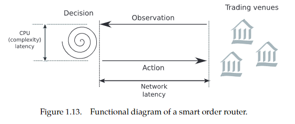

# 1.1
- fragmentation有多种层面：如多个operator, venue, order，乃至技术协议……总之，哪卖你就去哪
- marketshare: 直观上就是在你这个venue的turnover占比
  - 细节：包不包含fee
- 估算：认为价格常数
- 一种粗略指标：看per trade
- 不同时间，不同
- 有时考察fixing auctions，有时考察对多个stock不同加权方式
- 总结就是这个marketshare越fragmented，流动性越好
- 目的不同，要考察计算方式不同。比如你是要看venue的revenue，交易发生在哪的概率，还是一个美元在哪……
  - 注意：估算概率、置信区间当然需要[[优良标准]]里讲到的置信区间估计
- todo先看到这
# 1.2
- 拆分订单怎么做：一方面不能太Impact市场导致亏，另一方面等太久也有风险
- risk aversion: 两者不可兼得。出现tradeoff
- 于是根据risk aversion参数，画出curve（optimal trading schedules，非直线）
  - 以前这么做（时间拆分）就够了，现在还需要空间拆分（用smart order router）
  - 
  - 目标：保证量价，尽快（因为时间上的解已经解出了）
- 兵分几路，最小化总的impact
- agnostic: 不可知
- SOR当然要和数据仓库连，有合规要求，与execution policy一致等