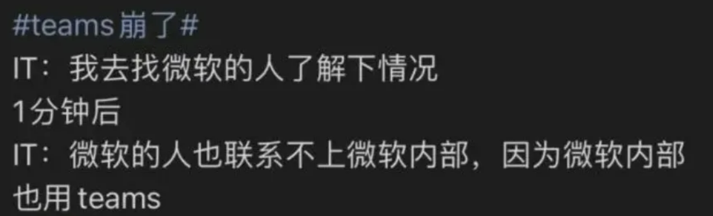

- 前置[[temp-solution]]
- 参考
  - [[2-eval]]，自助法是同一个词侧重点不同
  - 防止死循环，参考[[general-principles/recursion]]
- 词源
  - 解靴带自助，“自己提自己上天”
- 系统boot
  - 比如：ROM阶段，就没有别的设备可用。这就体现了词语bootstrap含义
  - 实例
    - [[u-disk-boot]]
    - linux命令`reboot`
- 更多例子（不一定官方名叫bootstrap但思想相同）
  - [[temp-solution]]
  - [[hosts]] -> [[proxy-basics]] -> Tor
    - 修改[[hosts]]临时上[[github]]下载翻墙客户端[[windows-proxy-client]]的阶段，就没有翻墙客户端可用
    - 只有个翻墙客户端阶段，就没有高速的洋葱浏览器（参考[[search-info/general]]）可用于上Tor
  - [[forward-port]]使得本地、远程之间互相临时借用翻墙接口，之后永久配置好翻墙
  - Tor（慢可直接翻墙） -> [[proxy-basics]] -> Tor（快）
  - [[grub-menu]]中：安装时`e`临时改设置 -> 安装成功后进系统时`e`临时改设置 -> 进去系统`/etc/default/grub`永久改设置
    - 按小写`e`编辑设置，这在[[windows-ubuntu]]中做了应急，起到核心作用！
    - 这里临时解决方案是“一次性的”，做了配置设置之后就可以永久
    - 但是你不做临时解决，那连系统都进不去
  - 比如先用`23`端口`telnet`去装`openssh-server`，之后再用`ssh`
- 趣事
  - https://www.zhihu.com/question/544520233/answer/2585745615
  - 