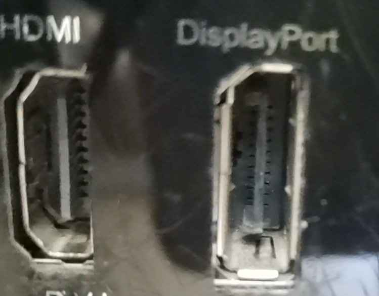
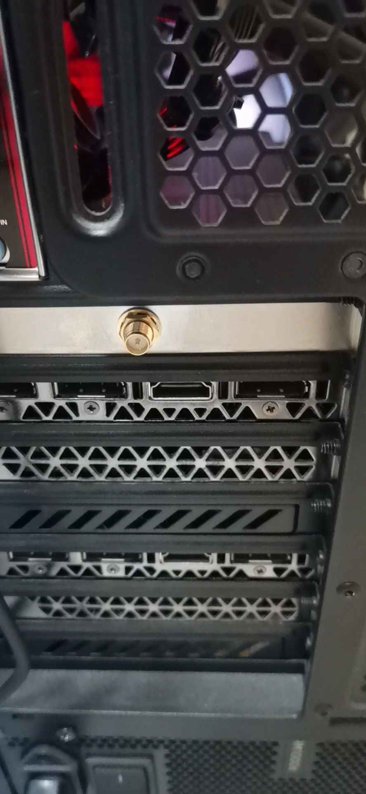

- 程序员最讨厌的四件事
  - 写注释
  - 写文档
  - 别人不写注释
  - 别人不写文档
- 写注释/文档时要换位思考考虑别人读的场景
  - 比如不要默认别人正在编辑器(vscode)中读。别人有可能在github上读呢
  - 所以出现的引用github代码的网址要明确tag（版本号），使得别人可以复制粘贴网址就阅读（而不是指望别人`Ctrl+左键`点击类名/函数名读）
- [[jupyter-basics]]本质就是可以用`markdown`注释，非常爽
- 实操
  - 例如
    - C的`//`
    - python等脚本语言的`#`或三引号字符串
      - 应用：[[vscode/edit]]时，选中一串东西，按三次`"`可注释
    - markdown（实质是[[html]]的）的`<!-- -->`
  - 快捷键往往是`Ctrl + /`，如[[jupyter-basics]]和[[vscode/edit]]都是
- 硬件处的注释
  - 来举个反例，某款迷惑机箱
    - 处有注释`HDMI`
      - 参考[[interface]]
      - 但这个口不能用
    - 下面有个没注释的口
      - 的靠上那个
      - 反而是能插HDMI公对公的
  - 正面例子：飞机上的安全带用法 
    - 让你往上抬打开它，很清晰