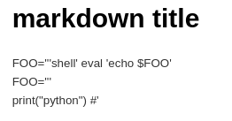
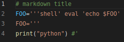
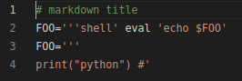

- 文件格式（扩展名）本质上是一种人为约定
[维基百科](https://zh.wikipedia.org/wiki/%E6%96%87%E4%BB%B6%E6%89%A9%E5%B1%95%E5%90%8D)
  - 既然是约定，就有时会有“方言”之类的
    - 例如[csv格式](https://baike.baidu.com/item/CSV)的“方言”：有时以逗号分隔，有时以制表符`\t`分隔等微小差别，并无统一标准，只需简单处理即可使用
  - 同样一种文件格式，有些打开它的程序识别的约定contract严格，有些宽松
  - 有些存储它的程序给出的约定严格，有些宽松
  - [Postel's law](https://en.wikipedia.org/wiki/Robustness_principle): 宽进严出。是一项好原则。因此A存储的文件B打不开，有可能C打开再保存就能用B打开了。因此C比A更遵守Postel's law.
- 扩展名“名”和文件本质“实”既不单射也不满射
  - 可能多种扩展名表示同一“本质”
    - 比如`.jpg, .bmp`都是图片（虽然这两者之间有不同）
    - 上面的还有点不服气？那看[这个](https://gearspace.com/board/music-for-picture/1185537-aiff-vs-aif.html)，`.aif, .aiff`就完全是一个意思
  - 也可能一种扩展名表示多种“本质”
    - 比如很多游戏都把自己的存档扩展名设置为`.sav`，但它们间显然不能互通
- 进一步的，“打开方式”和“实”（本质）也是既不单射也不满射
  - 可能多个程序打开同一“本质”文件
    - 比如很多程序都可以播放多媒体文件
    - 比如除了Office，也可以用[[excel-viewer]]打开`.xlsx`
    - 比如`.csv`可以被很多程序打开，作为数据传输媒介
  - 也可能一个程序能打开许多种“本质”的文件
    - 比如多媒体[[player]]
- 文件大体分为文本和二进制文件
  - 前者直接用编辑器打开可读，后者不可读
  - 前者好处是编辑器打开人类可读，后者好处是节省存储空间
    - 比如[[pointcloud/basics]]中的`.ply`之类格式就显然非常浪费空间
  - [[xxd-diff]]有提到把`.pkl`二进制文件`xxd`成文本`.hex`再使用`diff`，这就能体现出具体差别，而非简单地显示“differ”
  - 前者可以用通用编辑器如[[vim/basics]]，[[vscode/edit]]等编辑，所以很多时候可作为过渡，例如csv格式
  - [[file-handler]]读取文本文件（例如[[json]], [[yaml]]）就是“过渡”的例子
- 因此，只要你知道你在干什么，就可以修改扩展名
  - 一般文本文件是可以的。比如你需要一个`.dll`，可以直接新建文本文件，粘贴所需文本，保存为`.dll`格式
  - 例如创建文本文件
```text
# markdown title
FOO='''shell' eval 'echo $FOO'
FOO='''
print("python") #'
```
- 然后
  - 改为`.md`用markdown编辑器打开，效果如下
  - 改为`.py`，语法高亮如下，用`python`运行结果`python`
  - 改为`.sh`，语法高亮如下，用`bash`运行结果`shell`