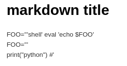
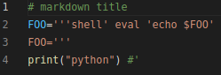
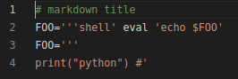

[toc]
- 前置[[encode-decode]]
## 本质
- 文件格式（扩展名）本质上是一种人为约定，参考[维基百科](https://zh.wikipedia.org/wiki/%E6%96%87%E4%BB%B6%E6%89%A9%E5%B1%95%E5%90%8D)
- 既然是约定，就有时会有“方言”之类的
  - 例如[csv格式](https://baike.baidu.com/item/CSV)的“方言”：有时以逗号分隔，有时以制表符`\t`分隔等
  - 微小差别，并无统一标准，只需简单处理即可使用
  - 参考[[input]]
- 同样一种文件格式，有些打开它的程序识别的约定contract严格，有些宽松
  - 例如有些程序可能可以识别各种分隔符的`csv`，而有些只能识别`\t`分隔的
- 有些存储它的程序给出的约定严格，有些宽松
- [Postel's law](https://en.wikipedia.org/wiki/Robustness_principle): 宽进严出。是一项好原则
  - A存储的文件B打不开，有可能C打开再保存就能用B打开了
  - 说明C“义务”地用更“严”的约定对文件进行保存，C比A更遵守Postel's law
## 名实关系
- 扩展名“名”和文件本质“实”既不单射也不满射
- 可能多种扩展名表示同一“本质”
  - 比如`.jpg, .bmp`都是图片（虽然这两者之间有不同）
  - 上面的还有点不服气？那看[这个](https://gearspace.com/board/music-for-picture/1185537-aiff-vs-aif.html)，`.aif, .aiff`就完全是一个意思
- 也可能一种扩展名表示多种“本质”
  - 比如很多游戏都把自己的存档扩展名设置为`.sav`，但它们间显然不能互通
## 打开方式
- “打开方式”和“实”（本质）也是既不单射也不满射
- 可能多个程序打开同一“本质”文件
  - 比如很多程序都可以播放多媒体文件
  - 比如除了Office，也可以用[[excel-viewer]]打开`.xlsx`
  - 比如`.csv`可以被很多程序打开，作为数据传输媒介
- 也可能一个程序能打开许多种“本质”的文件
  - 比如多媒体[[player]]
- 打开方式一般需要设置更改
  - 如：系统范围，设置默认打开方式
    - 如果默认打开方式不行，可能需要右键选择正确打开方式
    - 可能已经列出了，选一下默认打开方式就行
    - 而例如[[ise]]中，就默认没有列出，只能手动找相应程序
  - 如：vscode这样一个软件范围，设置默认打开方式
    - 如[[vscode-pdf]]中提到设置`.pdf`在vscode中的打开方式
## 文本和二进制文件
- 前者直接用编辑器打开可读，后者不可读
- 前者好处是编辑器打开人类可读，后者好处是节省存储空间
  - 比如[[pointcloud/basics]]中的`.ply`之类格式就显然非常浪费空间
- [[xxd-diff]]有提到
  - 把`.pkl`二进制文件`xxd`成文本`.hex`再使用`diff`，这就能体现出具体差别，而非简单地显示“differ”
  - 文本文件占空间更大，但可能更好传输[[file-transfer]]，适用场景广
- 前者可以用通用编辑器如[[vim-basics]]，[[vscode/edit]]等编辑，所以很多时候可作为过渡，例如csv格式
- [[file-handler]]读取文本文件（例如[[json]], [[yaml]]）就是“过渡”的例子
## 序列化（编码）
- 参考[[encode-decode]]
- 有时文件本身表达的东西不是简单的文本序列，但可以用文本序列存储
  - 例如[[jupyter-basics]]
    - `.ipynb`文件如果直接`cat`出来，是[[json]]格式
    - 但jupyter网页、插件等能读取这些[[json]]，显示出有结构的cell等
  - 例如[[html]]
  - 例如[[docx-zip]]
  - 例如[[pointcloud/basics]]
    - `.ply`用ascii字符串以人类可读形式存储所有信息，但可以用专门软件读出和可视化等
  - 例如[[xxd-diff]]提到的强行文本化
- 更广义的，一个文件夹中的文件组织格式等也是某种约定，也可以类比前述一些概念
  - 例如[[clone]]的`--bare`就是clone了“序列化”结果
  - [[docx-zip]]也有此意。`.docx`本质是个压缩包，是个文件夹
## 格式转换
- 修改扩展名：只要你知道你在干什么，就可以直接修改扩展名
### 直接修改文本文件扩展名
- 一般，对于文本文件可以直接修改扩展名。反正都是文本，通用
- 比如你需要一个`.dll`，可以直接新建文本文件，粘贴所需文本，保存为`.dll`格式
- 例如创建文本文件
```text
# markdown title
FOO='''shell' eval 'echo $FOO'
FOO='''
print("python") #'
```
- 然后
  - 改为`.md`用markdown编辑器打开，效果如下
  - 改为`.py`，语法高亮如下，用`python`运行结果`python`
  - 改为`.sh`，语法高亮如下，用`bash`运行结果`shell`
### 其它直接修改扩展名
- [[docx-zip]]：直接`.docx`和`.zip`互改
- [[file-transfer]]中为了保密，不被检测等起见可能直接改扩展名（使得不可打开），传输后再改回。例如微信传`.apk`，一些邮件传[[powershell-basics]]`.ps1`，都不可直接传
### 软件打开另存为
- 用软件打开A格式文件，再用软件的另存为功能得到B格式文件
- 当然也可能“宽进严出”，Postel's Law一下使得文件是同样格式但是更“好”
### 使用专用软件工具
- [[web-page-tools]]小工具
  - 例如 [miconv](https://miconv.com/)
  - 例如 [pdf2go](https://www.pdf2go.com/)可以把很多东西转化成pdf
- [[xxd-diff]]把二进制变成文本