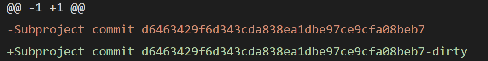
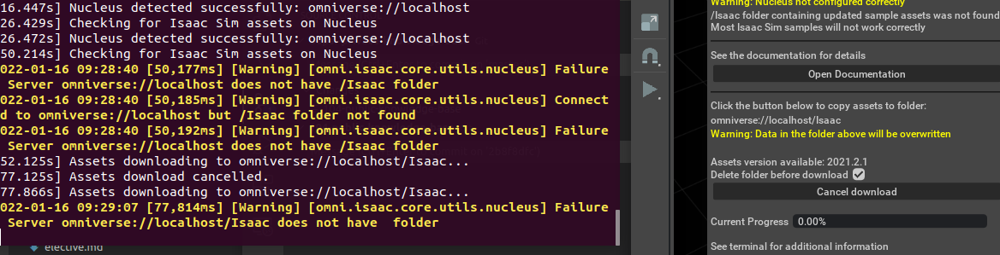
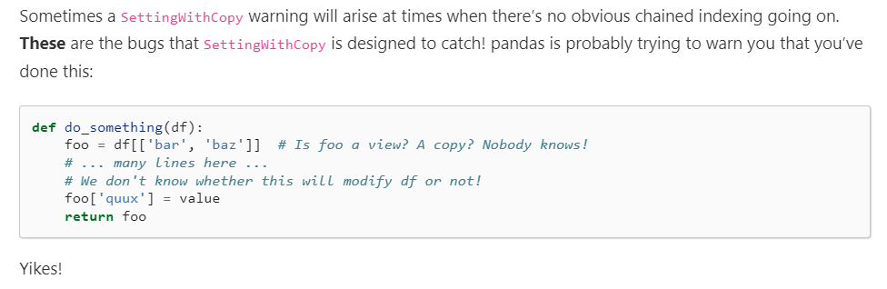
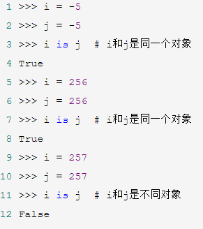

- 概述
  - [leaky abstraction现象](https://en.wikipedia.org/wiki/Leaky_abstraction)，维基上不少例子
  - 在许多学科都有（数学较少），计算机工程中尤其常见
  - 一大后果：不够[[general-principles/independent]]
- 参考
  - [[shell]]
- 例如很多人争议说要不要用命令行，还是只用编辑器、IDE例如[[vscode-installation]]
  - 根据leaky abstraction原则，命令行的基础操作要有了解，方便调试或者内网等特殊环境使用等
  - 在此基础上，在适用的时候可以用IDE节省时间
- 你完全不了解原始操作，肯定不行。原始操作需要有所理解，但高级包你也得会调，这样效率才最高
  - [[11-planning]]的第四节与这非常相关
  - [[contiguous]]数组提高效率
- 比如上层整合可能有的时候不把底层的错误传递出来（或者传递不清晰），需要直击底层才能找到错误所在
  - 关于[[known-hosts]]错误不清晰传播
    - [[remote-ssh]]插件在远程公钥变了的时候不把错误传递出来，这时你就得知道底层命令`ssh`，才能发现错误所在
    - [[submodule#添加和初始化]]命令如果远程unknown直接报错但不明确。相比之下[[clone]]命令提示你可以选择yes现场加[[known-hosts]]就比较好
  - [[view-git-log#git history]]插件在有untracked文件冲突时checkout没反应且不报错。这是你就得知道底层命令`git checkout`，尝试一下，才能发现错误所在
  - [[vscode-git]]
    - 遇到[[submodule]]作为changes出现conflict时
      - 
      - gui无法正常stage和commit
      - 必须手动命令行`git add <submodule文件夹名>`
    - 遇到你手动删除了[[known-hosts]]文件时，只有命令行`git push`才能弹出让你确认信任远程输入`yes`的提示。直接gui push没有提示直接报错
  - [[client-config]]中提到注释必须单独成行。如果没有做到，那么直接`ssh`连接会报错，但vscode会吃掉报错信息
  - [[assets]]中的这个
  - [[moveit-real-robot]]的命令不能运行，要[[fci]]里的底层命令才能传递出真正的错误原因
  - [[aruco]]中`clone`错分支导致运行时会process died，然后没任何日志，你要是不会底层操作就只能仔细检查，猜哪里出错。猜到是分支错算你厉害
  - [[franka-ros-interface]]是非官方库，没有特别好的维护。[[troubleshooting]]说的gripper disconnected需要插拔网线的错误没法传出来（即明明失败还返回`True`）
- 拓展：可能从上到下逐级看（或级太多时二分看），精确看到底是哪一级出错
  - 比如[[moveit-real-robot]]，[[fci]]的`communication_test`，直接`ping`，一共就是三级
  - 比如[[check-connectivity]]
- 比如上层整合可能引入额外的错误
  - 比如2022.1.17，vscode默认集成终端中跑[[rl-example]]就是不行。直接`Ctrl + Alt + T`的就是可以。可能和权限有关
  - 有的对象`pickle`可以，`torch`的[[save]]不行：https://github.com/dmlc/dgl/issues/458
  - 比如vscode的[[remote-ssh]]时，对面服务器环境可能不满足要求，[参考](https://code.visualstudio.com/docs/remote/linux#_remote-host-container-wsl-linux-prerequisites)
    - 但此时直接命令行`ssh`可以登录，然后`sudo apt install`对应包就行了
      - 题外话：但这里`apt install`动作要小心，因为升级`gcc`版本等可能有[[general-principles/upgrade]]所描述的问题。总之升级到最新不一定是可行的
- 比如上层封装太死，不灵活
  - 数学中
    - 证明[[相合性]]在无法使用强大数律时，拆一层包装直接用[[borel-cantelli]]
    - [[poisson-process]]求$P_i(t)$时，不直接调[[first-order-linear]]包而是使用常数变易法思想
  - 比如面试：“python是传值还是传引用”
    - 实际上，难以用二元对立简单概括python行为。因为python传引用但是赋值是重新绑定
    - 不能用简单的term来概括！
  - 比如python有一大堆包可以调，怎么取舍呢？
    - 要想清楚这个包能带来什么，代价是什么，如何替代
    - 比如做config
      - 有字典 - yaml - omegaconf - [[hydra]]这一链条
      - 如果你只使用hydra的compose功能，那完全可以不调它，只用原生（下层）的[[omegaconf/basic]]. 因为hydra的使用限制太多，有很多tricky的东西
      - 但是[[interpolation]]（惰性求值），[[resolver]]这些omegaconf的功能，原生yaml没有，所以我们要调omegaconf，所以到这一层就是不错的选择
    - 比如数学绘图，有[[matplotlib/basics]] - [[seaborn]]两层。很多时候直接[[seaborn]]好看，但有时需要更底层的[[matplotlib/basics]]指定一些细节
  - 比如[[robocorp]]中提到`rcc.exe`和vscode集成的关系（集成的必须用`conda.yaml`配置环境，但底层`rcc.exe`比较灵活，不用）
  - 比如[[lightning/logs]]中`self.log`不能在一epoch结束时汇总。想汇总需要`self.logger.experiment.add_scalar`，即使用更底层的[[tensorboard]] api
# 抽象不如你想象的clean
- 例如：“隔离”做得不好
  - 关于[[windows-ubuntu]]的坑
    - [[risk]]提到了直接删除第二系统的分区是不行的
    - [[partition]]中，直接移动系统盘分区是不行的
    - 刚刚的这些操作甚至有可能导致你[[u-disk-boot]]里的ubuntu都坏掉，必须格掉重写
  - 在[[container]]中的程序占用内存过多可能导致[[container]]外的也因为内存不足崩溃
  - 例如[[vpn]]被[[proxy-basics]]影响
    - 你以为[[proxy-basics]]客户端开着，不[[configure-proxy]]就没事？那不一定
    - 你以为代理和有些vpn能一起用了，那我关掉代理就能“正交”切换不影响vpn？那不一定
  - [2022.11江泽民去世，改黑白，却影响布局](https://zhuanlan.zhihu.com/p/588576333)
- 例如：你以为应该表现一样的实则不一样
  - 时至2022.8，pandas的[[time-series]]索引(index)有一个tricky bug
    - 
    - 同样的操作，有的时候是`copy`，有的时候是`view`，导致你无法确认赋值是否赋到了原对象上！
  - [python对小整数缓存](https://www.cnblogs.com/luoheng23/p/11023848.html#:~:text=%E5%B0%8F%E6%95%B4%E6%95%B0%E5%AF%B9%E8%B1%A1%E6%B1%A0,%E4%B8%BA%E4%BA%86%E5%BA%94%E5%AF%B9%E5%B0%8F%E6%95%B4%E6%95%B0%E7%9A%84%E9%A2%91%E7%B9%81%E4%BD%BF%E7%94%A8%EF%BC%8Cpython%E4%BD%BF%E7%94%A8%E5%AF%B9%E5%B0%8F%E6%95%B4%E6%95%B0%E8%BF%9B%E8%A1%8C%E4%BA%86%E7%BC%93%E5%AD%98%EF%BC%8C%E9%BB%98%E8%AE%A4%E8%8C%83%E5%9B%B4%E4%B8%BA%20%5B-5%2C256%5D%EF%BC%8C%E5%9C%A8%E8%BF%99%E4%B8%AA%E8%8C%83%E5%9B%B4%E5%86%85%E7%9A%84%E6%89%80%E6%9C%89%E6%95%B4%E6%95%B0%E8%A2%ABpython%E5%AE%8C%E5%85%A8%E5%9C%B0%E7%BC%93%E5%AD%98%EF%BC%8C%E5%BD%93%E6%9C%89%E5%8F%98%E9%87%8F%E4%BD%BF%E7%94%A8%E8%BF%99%E4%BA%9B%E5%B0%8F%E6%95%B4%E6%95%B0%E6%97%B6%EF%BC%8C%E5%A2%9E%E5%8A%A0%E5%AF%B9%E5%BA%94%E5%B0%8F%E6%95%B4%E6%95%B0%E5%AF%B9%E8%B1%A1%E7%9A%84%E5%BC%95%E7%94%A8%E5%8D%B3%E5%8F%AF%E3%80%82)
    - 
  - [[timestamps]]中`1680, 1670`