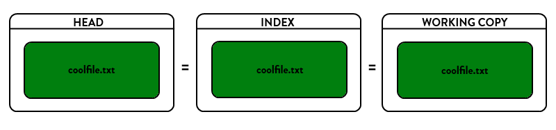

## #git 版本回退
 #版本管理
使用[[git-history]]查看如图，分为soft，hard，mixed三种reset
mixed为默认参数，上图中未出现
注：[[git-history]]只是一种可视化工具，你直接上github.com看或者用github desktop看也行

- soft告诉Git重置HEAD (见[[basics/basics]]) 到另外一个commit，这意味着index, working copy都不会变化，所有的在original HEAD和你重置到的那个commit之间的所有变更集都放在stage(index)区域中

  - 应用：[[discard-local]]中，aggregate一系列commit成一个，push到remote，避免remote的commit数量太多
- hard将重置HEAD返回到另外一个commit，重置index以便反映HEAD的变化，并且重置working copy也使得其完全匹配起来。这是一个比较危险的动作，具有破坏性，数据因此可能会丢失！
  - 应用：如果我们希望彻底丢掉本地修改但是又不希望更改branch所指向的commit，则执行`git reset --hard HEAD`
  - 另外一个场景是简单地移动branch从一个到另一个commit而保持index/work区域同步。这将丢失你目前的所有工作
  - 如果真是发生了数据丢失又希望找回来，那么只有使用：git reflog命令了。

- mixed是reset的默认参数。它将重置HEAD到另外一个commit,并且重置index以便和HEAD相匹配，但是也到此为止。working copy不会被更改，所有该branch上从original HEAD到你重置到的那个commit之间的所有变更将作为local modifications保存在working area中(modified but not staged)，你可以重新检视然后再做修改和commit.

- 综合应用：对于想在`A`这个commit上加上一些`B`commit的东西，可以先hard到`B`，再soft或mixed到`A`，然后看着挑哪些变动留下即可
## 和远程服务器相关的重置
[强行回退远程服务器上的版本](https://blog.csdn.net/wjrenxinlei/article/details/106473068)
- 大概就是hard reset后`git push origin HEAD:master --force`
  - 这是不推荐的行为，会被团队成员吐槽
  - 而且有时可能你没有这个权限