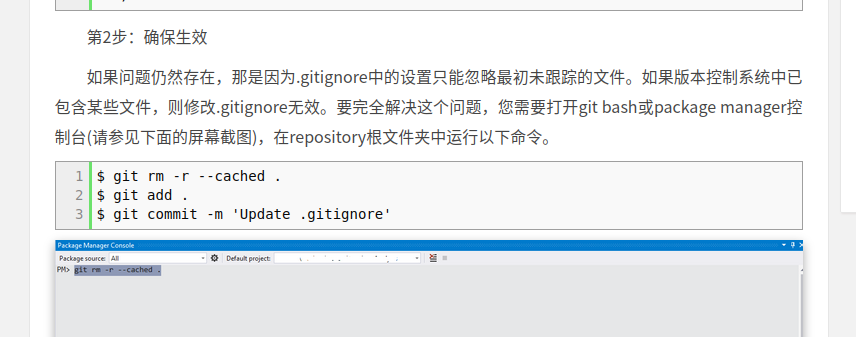

## dot-gitignore
文件名`.gitignore`
https://git-scm.com/docs/gitignore
https://www.jianshu.com/p/a09a9b40ad20
可以参考
比如
```text
__pycache__
*.pkl
path/to/a/folder
~$*
```
等等（即：可以匹配文件夹，也可以匹配后缀名，等等）
- `github`上有一些模板。往往不需要自己纯手动写。
  - 例如 https://github.com/github/gitignore
  - [[c-lang]]: https://github.com/github/gitignore/blob/main/C.gitignore
  - [[cpp]]: https://github.com/github/gitignore/blob/main/C%2B%2B.gitignore
  - [[cmake]] https://github.com/github/gitignore/blob/main/CMake.gitignore
- 自己添加`.gitignore`时一定要慎重，不要想当然。举例：以为`.txt`全是数据文件，没有用，但实际上有`pip`的`requirements.txt`非常重要

 todo 待整理
### 所在位置
参考[文档](https://git-scm.com/docs/gitignore)，如果在某个文件夹下有`.gitignore`那么只在某个文件夹及其子文件夹等等下生效。
一般不这么做（因为会导致你难以找到这个文件“到底被谁ignore了”）
不过像`.idea`这种pycharm和vscode自动生成的当然是没问题的
## `.gitkeep`
- 普通空文件夹
> 空文件夹默认不会上传到远程仓库。如果想在远程仓库中保存一个空文件夹作为占位符的话，可以在空文件中创建一个.gitkeep 文件即可
- 在合作时，这可能造成问题。你在本地能跑，提交之后，对方[[clone]]了未必还能跑

- “只能空的”空文件夹
  - 直接创建`.gitignore`，内容是
```text
*
!.gitignore
```
## `.gitmodule`
参考[[submodule]]
## issues
当然，对文件夹中文件遍历时，小心这些特殊文件引发问题