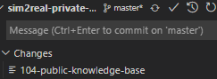

## 初始化
- 首先
`git submodule add -b <branch> <repo-link>`
- 然后`git submodule update --init --recursive`（在主模块运行），即可递归地初始化！
- 可以看到`.gitmodules`文件，以及递归初始化了的各个子模块

## 之后使用
- `git clone --recursive <链接>`
- 父模块最新时，子模块不一定是最新。可能需要单独`cd`进去`pull`
  - 具体解说
    - 观察到有时出现这种情况
    - 这种就说明子模块（自己作为独立的模块）更新了，但父模块没更新子模块版本
    - 你现在显示这样，那么之后在其它地方`git clone --recursive`时就不能得到最新版本子模块
- 如果最外层忘了`--recursive`，那么对于内层模块，手动`clone`一下也是可以的
## 删改
https://www.jianshu.com/p/ed0cb6c75e25
## 问题
- 有子模块经常会带来杂七杂八麻烦，比如[[vscode/settings]]中提到的`authentication`相关