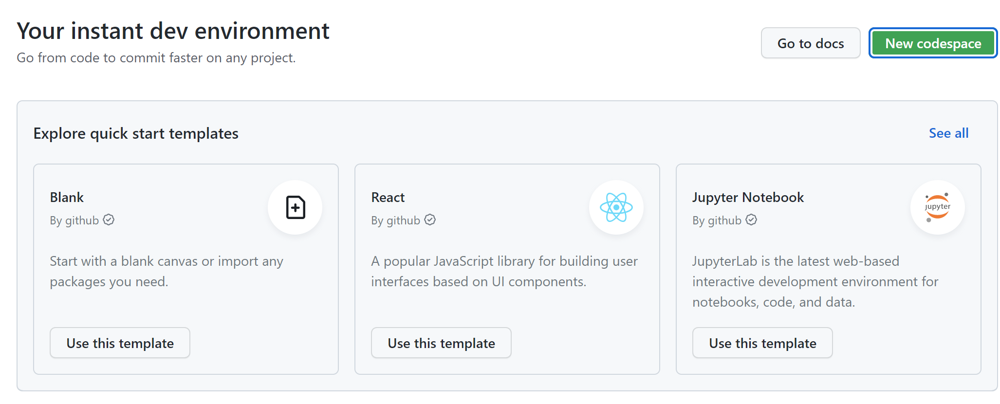

- 前置
  - github账号
  - linux基础（因为codespaces是个ubuntu系统），参考[[linux-and-shell/0-metadata]]
  - [[vscode/installation]]
  - 不妨了解[[settings-sync]]
- github首页上方codespaces
- 
  - 可以根据模板创建/由已有repo创建
  - 可以用在线vscode/本地vscode打开
- settings - 左侧codespaces处有更多设置
  - 例如是否可以GPG认证，默认本地vscode打开等