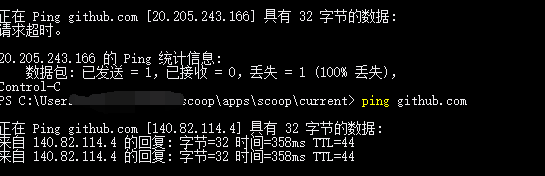

- 背景
  - 国内对github，以及2022年初对steam等的态度：不全部墙，但是有时给你[[dns]]污染一下
  - 所以有[[proxy-basics]]当然可以，但是没有？
    - 改hosts文件能部分解决问题
      - 当然不改的话，有时运气好也能上
- 拓展
  - 改[[dns]]
- 具体地：
1. 找到`github.com`的[[ip-address]]
  - https://ipaddress.com/website/github.com 这类网站查
    - `github.global.ssl.Fastly.net`的也可看看
    - 这种ip可能几十分钟就变了。要现用现查
  - 或：[参考这个库](https://github.com/ineo6/hosts)
    - 可以本地8888 [[port]]运行服务
2. 据此修改域名到ip的映射
    - windows的`C:\Windows\System32\drivers\etc\hosts`
    - linux参考[[dns]]
    - 或参考[这个库](https://github.com/ineo6/hosts)的文档
3. 效果验证
  - 改之前，ip是一个错的（污染了的）
  - 改后就对了（`ping`得通）
    - 
- 这种操作的作用
  - [[temp-solution]] [[bootstrap]]
  - 还可能是[[configure-proxy]]很麻烦时用于连接一些没被强力墙的网站
    - 如raw.githubusercontent.com，有些时候（如[[zsh]]，[[ros/installation]]），只需改hosts就足够能上了。而那些地方配置代理很麻烦
    - 如[[vscode-browser-extensions]]插件直到2022.7，根本没法配置代理