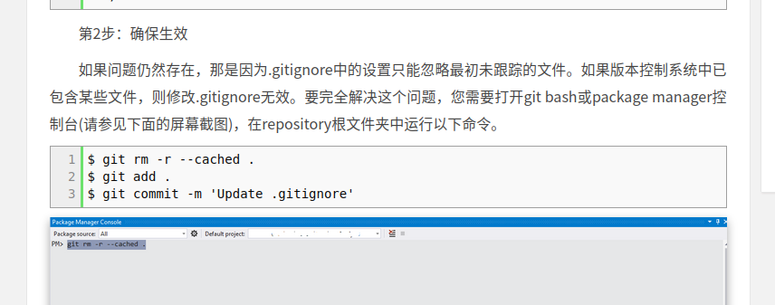

## `.gitignore`
https://www.jianshu.com/p/a09a9b40ad20
可以参考
比如
```text
__pycache__
*.pkl
path/to/a/folder
```
等等（即：可以匹配文件夹，也可以匹配后缀名，等等）
注意`github`上有一些模板。往往不需要自己纯手动写。
- 注：自己添加`.gitignore`时一定要慎重，不要想当然。举例：以为`.txt`全是数据文件，没有用，但实际上有`pip`的`requirements.txt`非常重要

 todo 待整理
## `.gitkeep`
> 空文件夹默认不会上传到远程仓库。如果想在远程仓库中保存一个空文件夹作为占位符的话，可以在空文件中创建一个.gitkeep 文件即可

名副其实的空文件夹：直接创建`.gitignore`，内容是
```text
*
!.gitignore
```