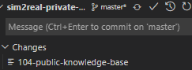

## 初始化
- 首先
`git submodule add -b <branch> <repo-link>`
- 然后
`git submodule update --init --recursive`（在主模块运行），即可递归地初始化！
- 可以看到`.gitmodules`文件，以及递归初始化了的各个子模块

## 之后使用
`git clone --recursive <链接>`
并且注意父模块最新，如果你没更新的话，子模块不一定是最新版。可能需要单独`cd`进去`clone`

像这种就说明子模块更新了，父模块没更新子模块版本。所以你之后在其它地方`git clone --recursive`就不能得到最新子模块