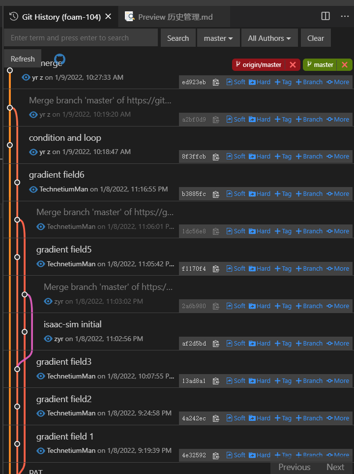

# 基于git history插件的git历史管理

vscode安装#git history插件后，要查看一个文件或文件夹的历史记录，
只需要在左边文件栏中右键点击某个文件/文件夹，

选择 git: view file history点击即可

文件编辑者和branch路径一目了然！

## 基础概念
### HEAD
这是当前分支版本顶端的别名，也就是在当前分支你最近的一个提交
### Index
index也被称为staging area，是指一整套即将被下一个提交的文件集合。他也是将成为HEAD的父亲的那个commit
### Working Copy
working copy代表你正在工作的那个文件集

### 操作过程
(https://www.cnblogs.com/kidsitcn/p/4513297.html)
当你第一次checkout一个分支，HEAD就指向当前分支的最近一个commit。在HEAD中的文件集和在index中的文件集是相同的，在working copy的文件集和HEAD,INDEX中的文件集是完全相同的。所有三者(HEAD,INDEX(STAGING),WORKING COPY)都是相同的状态，GIT很happy。

当你对一个文件执行一次修改，Git感知到了这个修改，并且说：“嘿，文件已经变更了！你的working copy不再和index,head相同！”，随后GIT标记这个文件是修改过的。

然后，当你执行一个git add,它就stages the file in the index，并且GIT说：“嘿，OK，现在你的working copy和index区是相同的，但是他们和HEAD区是不同的！”

当你执行一个git commit,GIT就创建一个新的commit，随后HEAD就指向这个新的commit，而index,working copy的状态和HEAD就又完全匹配相同了，GIT又一次HAPPY了。

## 版本回退

如图，分为soft，hard，mixed两种(mixed为默认参数图中未出现)

soft告诉Git重置HEAD到另外一个commit，但也到此为止。如果你指定--soft参数，Git将停止在那里而什么也不会根本变化。这意味着index,working copy都不会做任何变化，所有的在original HEAD和你重置到的那个commit之间的所有变更集都放在stage(index)区域中。

hard将重置HEAD返回到另外一个commit，重置index以便反映HEAD的变化，并且重置working copy也使得其完全匹配起来。这是一个比较危险的动作，具有破坏性，数据因此可能会丢失！
hard使用场景：如果我们希望彻底丢掉本地修改但是又不希望更改branch所指向的commit，则执行git reset --hard HEAD. 另外一个场景是简单地移动branch从一个到另一个commit而保持index/work区域同步。这将丢失你的工作，因为它将修改你的work tree！
如果真是发生了数据丢失又希望找回来，那么只有使用：git reflog命令了。

mixed是reset的默认参数。它将重置HEAD到另外一个commit,并且重置index以便和HEAD相匹配，但是也到此为止。working copy不会被更改,所有该branch上从original HEAD到你重置到的那个commit之间的所有变更将作为local modifications保存在working area中(modified but not staged)，你可以重新检视然后再做修改和commit.

