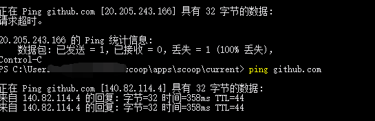

国内对github，以及2022年初对steam等的态度：不全部墙，但是有时给你DNS污染一下
改hosts文件能部分解决问题（当然不改的话，有时运气好也能上）
总之下载到第一个翻墙客户端，就是胜利。这就是[[bootstrap]]，一步一步来
具体地：
- https://ipaddress.com/website/github.com
这类网站查`github.com`的ip地址，和`github.global.ssl.Fastly.net`的ip地址
    - 这种ip可能几十分钟就变了。要现用现查
- 据此修改域名到ip的映射。比如windows的`C:\Windows\System32\drivers\etc\hosts`

效果验证：改之前，ip是一个错的（污染了的）。改后就对了（`ping`得通）
