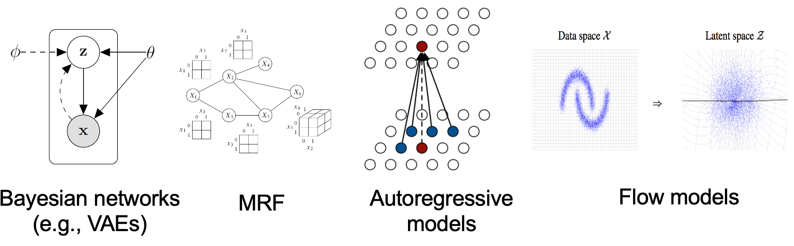

# 为什么需要gradient field
考虑现有 #生成模型 ，可分成两类：

## 基于似然的模型
即基于最大似然估计，直接对目标分布的概率密度进行建模。
如：自回归模型
(https://blog.csdn.net/shigangzwy/article/details/69525576),
标准化流模型(https://zhuanlan.zhihu.com/p/165577850), 
VAE(https://www.sohu.com/a/226209674_500659)等

缺陷：标准化常数难以处理，因此需对模型进行限制；
或者需要对最大似然的条件参数(归一化常数)进行近似(VAE)

## 隐式生成模型
即概率分布由对样本的采样过程去隐式表示的模型。
如GAN！

缺陷：需要对抗训练，这是出了名的不稳定！超级容易崩坏！

## 我们的方法
不是对概率密度进行建模，而是对概率密度函数的对数的梯度建模！即建模
$$\nabla_\mathbf{x} \log p(\mathbf{x})$$
即 #score function.
至于为啥更好呢，且听本文细细道来~

# score-based model优势分析
我们与基于似然的模型进行对比。
## 传统似然模型
现有一个数据集$\{\mathbf{x}_1, \mathbf{x}_2, \cdots, \mathbf{x}_N\}$, 并假设其从概率密度函数$p(\mathbf{x})$采样得到。
我们想建立一个包含参数$\theta$的模型，使得其能够很好的拟合$p(\mathbf{x})$。
作为一个示例，我们把概率密度函数假设为
$$
p_\theta(\mathbf{x}) = \frac{e^{-f_\theta(\mathbf{x})}}{Z_\theta} \tag{1}
$$
其中$Z_\theta > 0$是由$\theta$决定的归一化常数，使得概率密度积分为1。
我们想要优化参数$\theta$，来最大化我们假设的概率密度函数的似然函数(取对数后)，即：
$$
\max_\theta \sum_{i=1}^N \log p_\theta(\mathbf{x}_i) \tag{2}
$$
但是要满足上式优化过程，我们必须要求$p_\theta(\mathbf{x})$已经经过了归一化，使得其的确是一个概率密度函数。那我们就必须处理归一化常数$Z_\theta$，而对一般的$f_\theta(\mathbf{x})$来说，$Z_\theta$并不容易被表示。因此传统基于似然的模型必须限制模型结构以处理$Z_\theta$，或近似$Z_\theta$。

## score-based model
当我们估计的是对数概率密度的**梯度**的时候，我们就不用管这个归一化常数了！
因为根本用不着归一化！！！
即：定义概率密度$p(\mathbf{x})$的score function为$\nabla_\mathbf{x} \log p(\mathbf{x})$，并通过优化一个带参数$\theta$的score-based模型$\mathbf{s}_\theta(\mathbf{x})$，来逼近这一个score function！

例如对于以上假设的概率密度函数(1)，可以估计如下：
$$
  \mathbf{s}_\theta (\mathbf{x}) = \nabla_{\mathbf{x}} \log p_\theta (\mathbf{x} ) = -\nabla_{\mathbf{x}}  f_\theta (\mathbf{x}) - \underbrace{\nabla_\mathbf{x} \log Z_\theta}_{=0} = -\nabla_\mathbf{x} f_\theta(\mathbf{x})   
$$
让归一化常数见鬼去吧！

## score matching
我们通常通过最小化Fishel散度(即L2 loss)来训练，即最小化
$$
\mathbb{E}_{p(\mathbf{x})}[\| \nabla_\mathbf{x} \log p(\mathbf{x})y - \mathbf{s}_\theta(\mathbf{x})  \|_2^2] .
$$
我们不知道样本真实分布$\nabla_\mathbf{x} \log p(\mathbf{x})$，但我们可以用score matching的方式去估计其Fishel散度，见后文。

