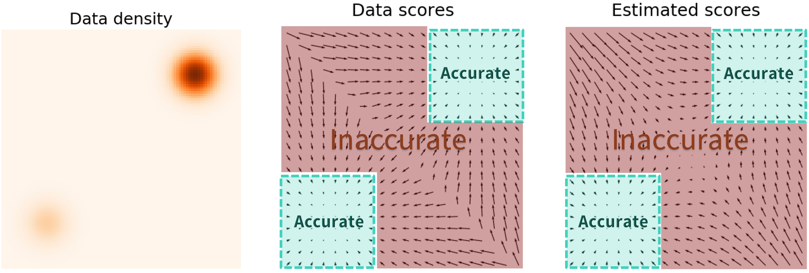
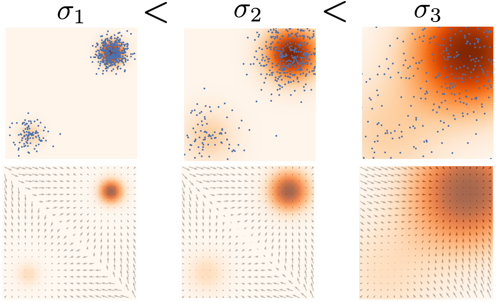

# 为什么需要gradient field
考虑现有 #生成模型 ，可分成两类：

## 基于似然的模型
即基于最大似然估计，直接对目标分布的概率密度进行建模。
如：自回归模型
(https://blog.csdn.net/shigangzwy/article/details/69525576),
标准化流模型(https://zhuanlan.zhihu.com/p/165577850), 
VAE(https://www.sohu.com/a/226209674_500659)等

缺陷：标准化常数难以处理，因此需对模型进行限制；
或者需要对最大似然的条件参数(归一化常数)进行近似(VAE)

## 隐式生成模型
即概率分布由对样本的采样过程去隐式表示的模型。
如GAN！

缺陷：需要对抗训练，这是出了名的不稳定！超级容易崩坏！

## 我们的方法
不是对概率密度进行建模，而是对概率密度函数的对数的梯度建模！即建模
$$\nabla_\mathbf{x} \log p(\mathbf{x})$$
即 #score function.
至于为啥更好呢，且听本文细细道来~

# score-based model优势分析
我们与基于似然的模型进行对比。
## 传统似然模型
现有一个数据集$\{\mathbf{x}_1, \mathbf{x}_2, \cdots, \mathbf{x}_N\}$, 并假设其从概率密度函数$p(\mathbf{x})$采样得到。
我们想建立一个包含参数$\theta$的模型，使得其能够很好的拟合$p(\mathbf{x})$。
作为一个示例，我们把概率密度函数假设为
$$
p_\theta(\mathbf{x}) = \frac{e^{-f_\theta(\mathbf{x})}}{Z_\theta} \tag{1}
$$
其中$Z_\theta > 0$是由$\theta$决定的归一化常数，使得概率密度积分为1。
我们想要优化参数$\theta$，来最大化我们假设的概率密度函数的似然函数(取对数后)，即：
$$
\max_\theta \sum_{i=1}^N \log p_\theta(\mathbf{x}_i) \tag{2}
$$
但是要满足上式优化过程，我们必须要求$p_\theta(\mathbf{x})$已经经过了归一化，使得其的确是一个概率密度函数。那我们就必须处理归一化常数$Z_\theta$，而对一般的$f_\theta(\mathbf{x})$来说，$Z_\theta$并不容易被表示。因此传统基于似然的模型必须限制模型结构以处理$Z_\theta$，或近似$Z_\theta$。

## score-based model
当我们估计的是对数概率密度的**梯度**的时候，我们就不用管这个归一化常数了！
因为根本用不着归一化！！！
即：定义概率密度$p(\mathbf{x})$的score function为$\nabla_\mathbf{x} \log p(\mathbf{x})$，并通过优化一个带参数$\theta$的score-based模型$\mathbf{s}_\theta(\mathbf{x})$，来逼近这一个score function！

例如对于以上假设的概率密度函数(1)，可以估计如下：
$$
  \mathbf{s}_\theta (\mathbf{x}) = \nabla_{\mathbf{x}} \log p_\theta (\mathbf{x} ) = -\nabla_{\mathbf{x}}  f_\theta (\mathbf{x}) - \underbrace{\nabla_\mathbf{x} \log Z_\theta}_{=0} = -\nabla_\mathbf{x} f_\theta(\mathbf{x})   
$$
让归一化常数见鬼去吧！

那么我们怎么拿这样的梯度$\nabla_\mathbf{x} \log p(\mathbf{x})$训练和采样呢？
用score matching训练，MCMC采样即可，如下。

## score matching
我们通常通过最小化Fishel散度(即L2 loss)来训练，即最小化
$$
\mathbb{E}_{p(\mathbf{x})}[\| \nabla_\mathbf{x} \log p(\mathbf{x})y - \mathbf{s}_\theta(\mathbf{x})  \|_2^2] .
$$
我们不知道样本真实分布$\nabla_\mathbf{x} \log p(\mathbf{x})$，但我们可以用 #score_matching 的方式去估计其Fishel散度，见后文。

## Langevin dynamics-MCMC采样
在本模型中的目的：从一个已知的$\nabla_\mathbf{x} \log p(\mathbf{x})$(包括训出来的$\mathbf{s}_\theta (\mathbf{x})$)中采样数据点，使其收敛到目标概率密度$p(x)$。
原理见 https://blog.csdn.net/arcers/article/details/88732639 (有空再看)

在已知$\nabla_\mathbf{x} \log p(\mathbf{x})$的条件下，如下采样：
从任意先验分布初始化初值$\mathbf{x}_0 \sim \pi(\mathbf{x})$，接着使用下式迭代采样：
$$
\mathbf{x}_{i+1} \gets \mathbf{x}_i + \epsilon \nabla_\mathbf{x} \log p(\mathbf{x}) + \sqrt{2\epsilon}~ \mathbf{z}_i, \quad i=0,1,\cdots, K
$$
其中随机误差呈正态分布$\mathbf{z}_i \sim \mathcal{N}(0, I)$。
当$\epsilon \to 0$, $K \to \infty$时， $x_i$的分布收敛到$p(x)$，如图。

# 朴素的score-based模型及缺陷
所谓朴素模型，就是直接score matching硬拟合梯度，然后用以上MCMC模型采样，其他的什么都不加。但实际上效果并不好！
原因：score function估计值在低密度区域非常不准确！

如图，人脸图片(或者绝大部分生成模型想要生成的数据)在整个数据空间的分布是非常非常集中的！
数据空间的绝大部分区域都压根儿没有人脸样本，那你咋估计这部分区域的梯度？
你估不准这部分区域的梯度，那你咋走到人脸分布集中的地方？

**Naive!**

解决方案：**加噪声**！往死里加！

# 多噪声扰动的score-based模型

根本思想：通过加噪声来填充低密度区域，增加其密度来增加估计准确性！
先加一个高斯噪声试试：

如图，与上一张图对比着看，是不是低密度区域的梯度明显多了！

## 多尺度噪声
但是噪声加大了也不行，因为会破坏原有数据分布！那咋办？
答曰：加几次**不同尺度**的噪声！

如图，不同尺度的噪声，带来不同尺度的梯度：
大噪声有利于低密度区域的估计，小噪声忠实于数据原本的分布！
我们希望把不同尺度的噪声信息都用上！所以我们对多个噪声尺度的L2 loss求加权和：
$$
\sum_{i=1}^L \lambda(i) \mathbb{E}_{p_{\sigma_i}(\mathbf{x})}[\| \nabla_\mathbf{x} \log p_{\sigma_i}(\mathbf{x}) - \mathbf{s}_\theta(\mathbf{x}, i)  \|_2^2]
$$
通常给大噪声更大的权重，常选择$\lambda(i) = \sigma_i^2$。

## 退火采样
现在我们得到了综合了多级噪声的估计$\mathbf{s}_\theta(\mathbf{x}, i)$，其中噪声序列为$\sigma_1 < \sigma_2 < \cdots < \sigma_L$.
现在基于此估计运行Langevin dynamics的MCMC采样。根据退火的思想，我们从高噪声往低噪声采样，以使得最终分布受到的扰动尽可能小。即：依次生成样本$i = L, L-1, \cdots, 1$，使得噪声尺度随时间而减小，如图。

## 接下来要补充的内容
- [ ] SDE score based模型
- [ ] score matching具体方法
- [ ] sliced score matching
- [ ] annealed score-matching

