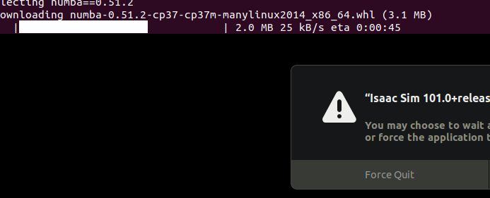

[toc]
# Adding Sample Assets
前置：
- [[installation]]

按照[指示](https://docs.omniverse.nvidia.com/app_isaacsim/app_isaacsim/setup.html#adding-sample-assets)做即可。
- 其中要求你访问[8080端口](http://localhost:8080/)
- 并在网页右上角如图处切换账号，用账号密码都是`omniverse`登录

（当然如果一来是登录界面说明你尚未登录，直接账号密码都是omniverse登录即可）
- 继续根据[指示](https://docs.omniverse.nvidia.com/app_isaacsim/app_isaacsim/setup.html#adding-sample-assets)做。过程中需要打开isaac.
截至2021.11.20，第一次打开isaac sim时，它的装包过程会被误当成“无响应”。我们可以`Ctrl + Alt + Delete`再Cancel脱离卡顿状态，观察其装包过程如图

- 根据[指示](https://docs.omniverse.nvidia.com/app_isaacsim/app_isaacsim/setup.html#adding-sample-assets)顺利添加Assets.
按道理现在应该可以用isaac了，成功后应当看到显示如下。

- 如果viewport显示全灰，参考[官网troubleshooting](https://docs.omniverse.nvidia.com/app_isaacsim/prod_kit/linux-troubleshooting.html#)。特别重要：参考**终端**（即启动isaac sim时，同时自动跑出来，输出一大堆信息的那个终端）的**错误信息**！
  - 比如之前有一次在终端看到错误信息`VK_INITIALIZATION...`之类的。**谷歌搜索错误信息**，然后按谷歌指示重装Vulkan SDK，重启就解决了问题
## 11.28更新
最新有效Adding Sample Assets教程链接是
https://docs.omniverse.nvidia.com/app_isaacsim/app_isaacsim/install_basic.html#isaac-sim-first-run
## 12.11更新

如果Download一直卡在0%，就更新Cache版本。（来自nvidia官网论坛的isaac相关版面）
可以看到Isaac 2021.2.0确实很新。这个工作人员回复日期在11.30
## 12.14更新
非常有趣的是：如果你删除Isaac文件夹，并重装Isaac Sim 2021.1.1（旧版本），那么第一次启动他让你参考doc下载Assets时，会把你导向一个失效的doc链接（可以认为这是更新疏忽）。
这时不理会他，直接安装Isaac Sim 2021.2.0并下载使用新版本的Assets即可。即：2021.2.0的Assets在2021.1.1版本也能用
不过我们也没必要执着于旧版本
## 2022.1.14更新
目前会卡进度在99.99%，但是Isaac Utils - Nucleus Check又说没问题，那就先不管吧