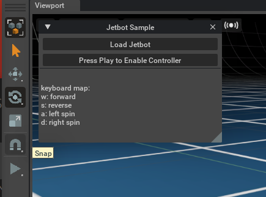
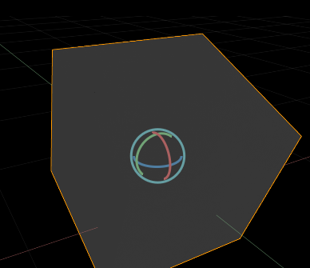
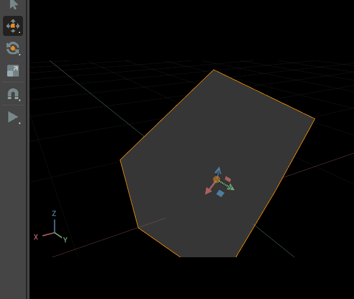
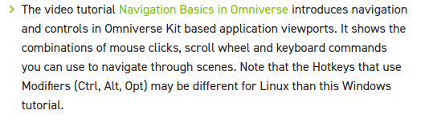
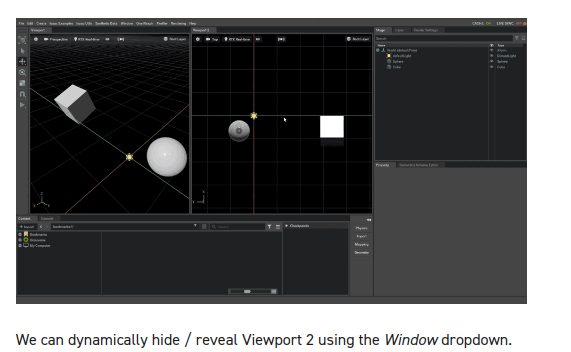
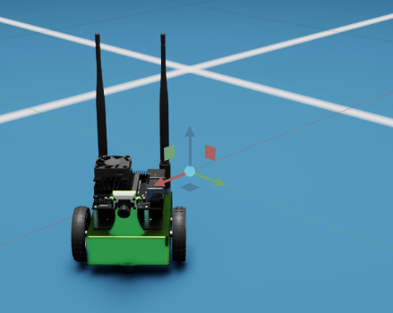

[toc]
# isaac sim初体验
前置：
- [[assets]]

==本篇撰写时间为2021.11.23
Linux version 5.4.0-84-generic (buildd@lcy01-amd64-007) (gcc version 7.5.0 (Ubuntu 7.5.0-3ubuntu1~18.04))
有 #时效性 。随着Isaac更新，一些细节可能会发生变化==
本篇体验 #isaac-sim 是使用GPU加速的先进的 #模拟器 ，方便做 #机器人 任务和 #RL .
https://docs.omniverse.nvidia.com/app_isaacsim/app_isaacsim/first_run.html
## 12.4更新
Isaac Sim版本已升级至2021.2.0，因此上面的链接失效了。后面的旧链接和旧说明文字也大多失效了。
现在的新手教程最初部分的链接
https://docs.omniverse.nvidia.com/app_isaacsim/app_isaacsim/tutorial_required_interface.html#isaac-sim-app-tutorial-required-interface
## 键盘控制Sample
- 先试试键盘控制小车Sample
https://docs.omniverse.nvidia.com/app_isaacsim/app_isaacsim/sample_jetbot.html
按照提示操作。
注意可以把这个弹出窗口Dock到边上

键盘wasd控制操作
- 如果处于“停止”状态，则机器人动不了，需要按左侧三角形播放按钮才能开始。

- Viewport选项卡按叉可以关掉，在菜单-Window可以再次打开。
### 12.4更新

新的教程在这里，第一步体验是创建Cube并平移旋转等。
https://docs.omniverse.nvidia.com/app_isaacsim/app_isaacsim/tutorial_required_interface.html#getting-started
- 切换Gizmo（平移或旋转或缩放）: `W, E, R`
- 退出选择: `Esc`
- 多次按`W, E`: 切换“全局”与“局部”坐标系。如下图是局部坐标系。

之后都可依教程进行。不过我们此处并不给GUI操作太多注意力了。自己看教程即可。
- 小常识：表示键盘快捷键时，用`LMB`表示鼠标左键。
- Pan此处意为摇镜头（来自Panoramic）

`Ctrl`, `Alt`, `Opt`分别在Linux对应了什么健？请自己试试。
- 右侧Stage处树结构：父节点带着子节点动。
transform表示的是相对于父节点的。
- 新教程虽然脉络有所不同，但是到了1.5处也讲了视图设置相关的东西。

- 1.6讲插件时也涉及到了播放按钮的功能。
- 之前说的小车例子在菜单“Isaac Examples - Input Devices”里还找得到。只不过如果用2021.1.1旧版本Assets，地面会出问题。为了升级2021.2.0后为了让他work，需要
    - 升级CACHE
    - 删除之前的旧Assets（`Isaac`文件夹）
	- 重新下载Assets
具体参见[[assets]]
	- 注：
正常运行的效果

### 2022.1.14更新
现在下载新Assets有删除旧Assets的选项了。勾选即可