[toc]
# isaac sim安装
前置：
- 有 #NVIDIA #GPU 和驱动
- 有NVIDIA账号
- 良好的网络环境（如果中国大陆可能需要[[linux翻墙]]）

==本篇撰写时间为2021.11.20
Linux version 5.4.0-84-generic (buildd@lcy01-amd64-007) (gcc version 7.5.0 (Ubuntu 7.5.0-3ubuntu1~18.04))
有 #时效性 。随着Isaac更新，一些细节可能会发生变化==
本篇安装 #isaac-sim 是使用GPU加速的先进的 #模拟器 ，方便做 #机器人 任务和 #RL .
## 确认满足需求
https://docs.omniverse.nvidia.com/app_isaacsim/app_isaacsim/requirements.html
首先确认硬件和驱动（`nvidia-smi`查看）要求
太老的显卡装不了。对Ubuntu系统版本也有要求。
注意：其==2021.11.20==推荐驱动版本460倒并不是必须的。至少我用470版本可以装。
这里官方教程的“栈深度”有点深（为了装Isaac要装Nucleus，进而要先装Launcher，然后装Launcher又要登录，登录又要邮箱确认……）
容易把配环境的人劝退……
### 11.28更新
Isaac现已从之前本文描述的2021.1.1更新至2021.2.0版本。之前本文的许多链接和文字将在新版本失效。
官方文档也更新了。非常令人高兴的是**栈不再那么深**了。
下面这个是最新的有关install的有效链接。
https://docs.omniverse.nvidia.com/app_isaacsim/app_isaacsim/install_basic.html
已经装了旧版本的可以在下图这里升级。
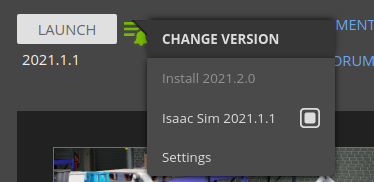
2021.2.0推荐的驱动版本是470
注：该图"Settings"处还有卸载按钮

## Omniverse Launcher
https://www.nvidia.com/en-us/omniverse/
点击
出来问卷，简单填一下。
点击下图的Download here for `Linux`
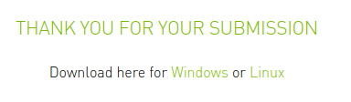
下载到`.AppImage`

在其所在文件夹打开终端，`chmod a+x omniverse`然后`Tab`补全，回车，赋予其运行权限。
双击它打开
登录NVIDIA账号（如果是新装的电脑，对以前登录过的账号，可能有Security Challenge，需要邮箱验证）
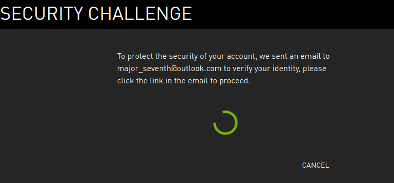
 登录之后同意一个协议
 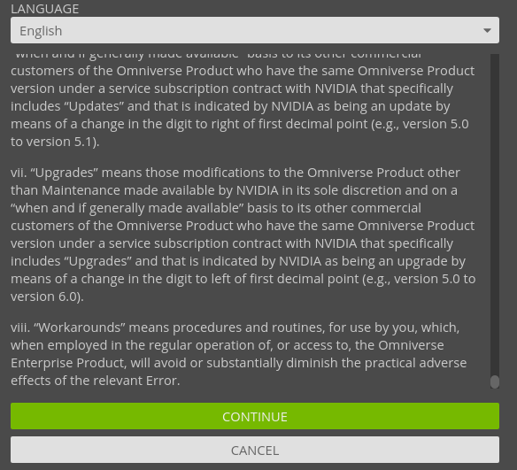
 然后一路continue
## Launcher中安装组件
- 到EXCHANGE选项卡，安装CACHE
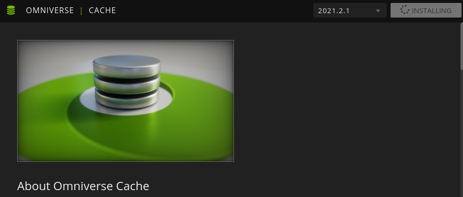
注：这些安装的prepare有时挺久的，视网络情况而定。需要耐心。多试几次吧。
注：本节三个组件可以**一起按安装，让它排队**。这么做有个关键好处：“趁着现在网络状态好赶紧全搞定”。
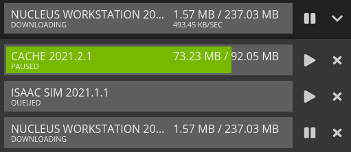
- 到NUCLEUS选项卡，按
https://docs.omniverse.nvidia.com/prod_nucleus/prod_nucleus/installation/workstation.html#installing-using-omniverse-launcher
安装NUCLEUS.
（过程中需要注册一个管理账号。请记住）
验证安装成功：按官网的做法即可。例如访问
http://localhost:8080/
并用账号密码都为admin登录。
- 到EXCHANGE选项卡，安装ISAAC SIM
结果
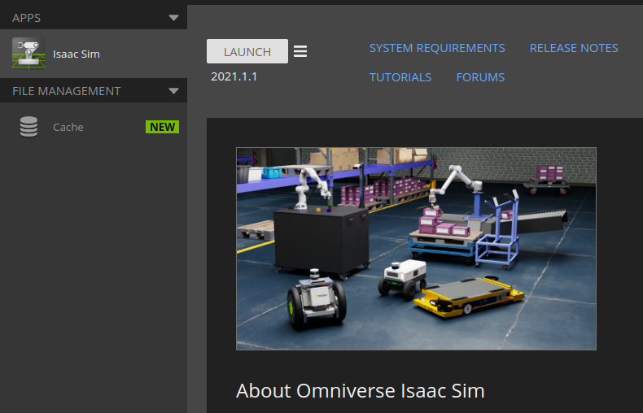
### 2022.1.8更新
新的安装nucleus教程链接
https://docs.omniverse.nvidia.com/prod_nucleus/prod_nucleus/workstation/installation.html
## Adding Sample Assets
按照
https://docs.omniverse.nvidia.com/app_isaacsim/app_isaacsim/setup.html#adding-sample-assets
指示做即可。
（首先访问
http://localhost:8080/
并使用账号密码都为omniverse的账号登录）
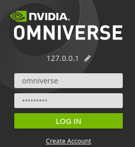
（网页右上角有切换账号按钮）
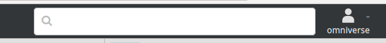
继续根据网页指示做。其中需要打开isaac.
==截至2021.11.20，第一次打开isaac sim时，它的装包过程会被误当成“无响应”。我们可以`Ctrl + Alt + Delete`再Cancel脱离卡顿状态，观察其装包过程==

根据网页指示顺利添加Assets.
### 11.28更新
最新有效教程链接是
https://docs.omniverse.nvidia.com/app_isaacsim/app_isaacsim/install_basic.html#isaac-sim-first-run
### 12.11更新

如果Download一直卡在0%，就更新Cache版本。（来自nvidia官网论坛的isaac相关版面）
可以看到Isaac 2021.2.0确实很新。这个工作人员回复日期在11.30
### 12.14更新
非常有趣的是：如果你删除Isaac文件夹，并重装Isaac Sim 2021.1.1（旧版本），那么第一次启动他让你参考doc下载Assets时，会把你导向一个失效的链接（可以认为这是更新疏忽）。这时不理会他，直接安装Isaac Sim 2021.2.0并下载使用新版本的Assets即可。2021.2.0的Assets在2021.1.1版本也能用
## 查找和解决错误
成功打开了isaac sim，但是viewport没有显示。（全灰）
**查看isaac sim终端上显示的错误信息**`VK_ERROR_INITIALIZATION_FAILED`，发现是Vulkan炸了，直接谷歌解决方法，知道**重装Vulkan SDK，再重启一下就能解决**。具体怎么重装自行搜索。
总之NVIDIA问题确实多，但是这个ISAAC终端错误输出很详细，倒是不会太让人觉得崩溃
我们看到显示了
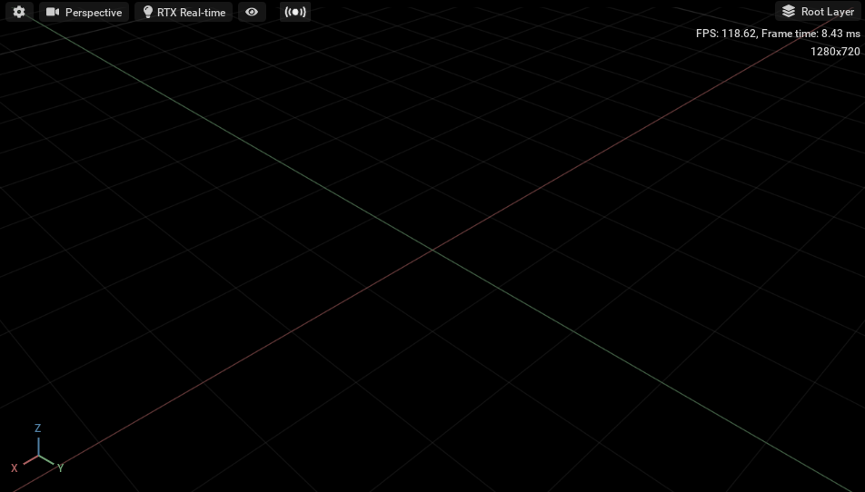
## 自我总结问答
0. Q: AppImage和Docker Image有什么异同？
A: 核心思想都是独立成体系和外界隔离。对外界“不敏感”，副作用小。
AppImage实际上更像docker的“容器”概念
1. Q: 这样问问题好吗？!
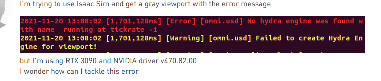
A: 我们先不吐槽垃圾英语和语法错误了。首先这截图，别人不方便查。其次明明完整的错误提示（日志）有很多关键信息都没放进来（事实上，这个错误是Vulkan出错的结果。光看这个根本看不出根本原因。而Vulkan那个错谷歌一下能解决）。