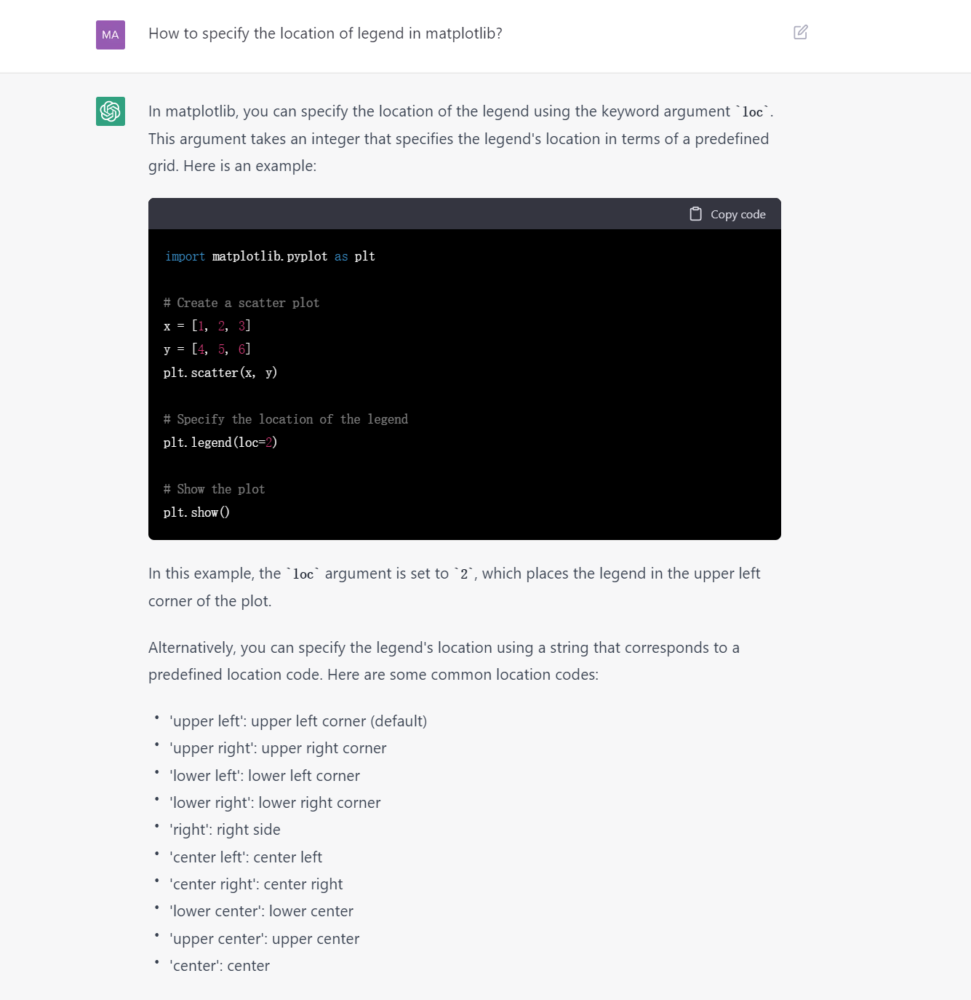
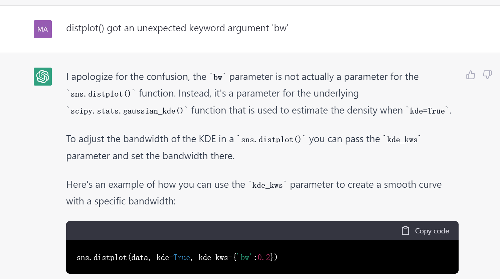

[toc]
# 前置
  - [[openai-account]]
    - 也可用[[telegram]] bot，就无需[[openai-account]]，但可能有限制
    - `https://t.me/ChatGPT_General_Bot`
  - [[proxy-basics]]
  - 适当[[node]]
    - 用不了的node表现：
# 用法
- 基本：在下方框敲东西让它回答
  - [[region-language]]
    - 可使用中文/英文/各种文字
    - 当然英文效果好
    - 中文在2023.6已经可能触发风控被ban
      - 参考[[openai-account]]
      - 因此需要[[web-page-tools]]翻译工具结合
  - 也可结合[[region-language#IME]]语音输入法练口语
- 可以编辑之前的提问，或重试等，回答可能更好
- 回答不完整
  - 某[[general-principles/upgrade]]前，可以说`continue`或`继续`
  - 某[[general-principles/upgrade]]后，可以直接按Continue按钮
- 不断[[general-principles/upgrade]]，有许多功能更新
  - 储存并查看之前的chat内容
  - 自动生成摘要标题作为网页标题
  - 氪金Upgrade to plus
  - ...
# 提示工程
- [[chatgpt-prompting]]
# 其它
- 可以发挥想象力，玩各种各样的事，如
  - 如何解决台湾问题
  - 普京给特朗普的情书
  - 针对博士后生活改编波希米亚狂想曲
  - 扛200斤麦子走……里需要做多少功？
  - （你懒得查文档时）帮助编程： 
    - 这里问到了[[matplotlib/basics]]中的`legend`位置
    - 有时会生成错误过时答案。所以用它写程序要小心
      - 但你可以把报错反馈回去，他可能就改正了
      - 
  - 给出“指令”：`rephrase:`, `proofread:`, `expand:`之类的，后跟一段。可以降重、自动写文章等
    - 具体例子：`please refine this markdown code. please give me your generations in code blocks instead of directly present it --- or I can't copy it.`
  - ……
- 人机交互结合
  - 写文章次序：人调实质内容，chatgpt调表达润色，人最后调格式字数（如每段顶格等）
# 友情链接
- [[waitlists]]
- 更高级的[[gpt-4]]
- [chatpdf](https://www.chatpdf.com/)
  - 读论文读书审稿等用
  - 文章太长了，用[[web-page-tools]]截取
    - https://www.pdf2go.com/
  - 免费的有每日限流，单文件限大小页数
- [[cursor-ide]]
- [[telegram]] bot