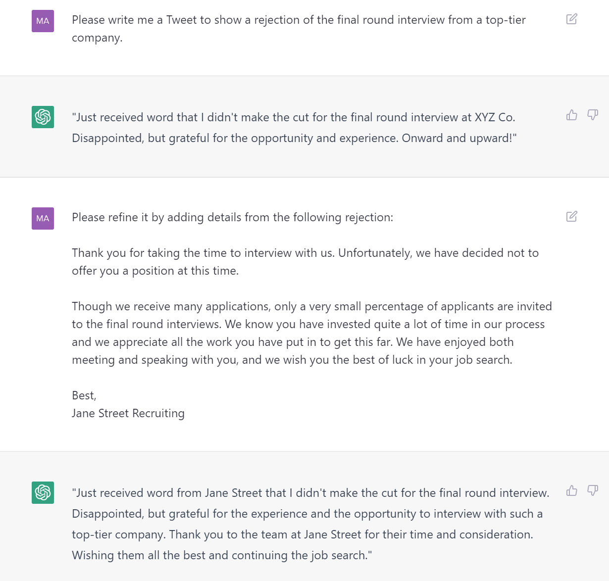
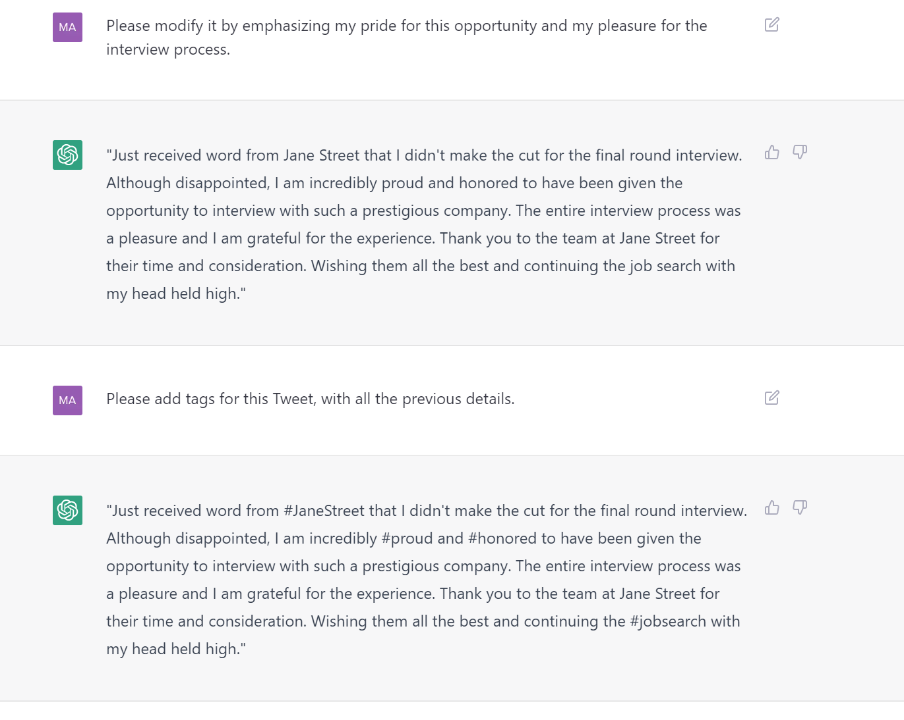

# 前置
- [[chatgpt]]
- [参考](https://www.promptingguide.ai/)

# 基础
- ChatGPT可以按照指示逐步进行操作。
  -  这个例子展示了如何逐步给出指示
- 如果ChatGPT的输出不满足要求或预期，你可以：
  - 尝试重新运行 [[refresh]]
  - 编辑输入，重点指出你的要求，然后重新提交
  -  这个例子展示了如何明确指出要求

# 绕过限制
- ChatGPT有时会自我设限，但实际上它可以完成更多的任务。你可以尝试找到方法绕过这些限制。
- 例如，有一段时间"Please memorize"这个指令无法执行，但是如果改为"Please commit it to your memory"，就可能可以执行了。
  - [[memorization]]