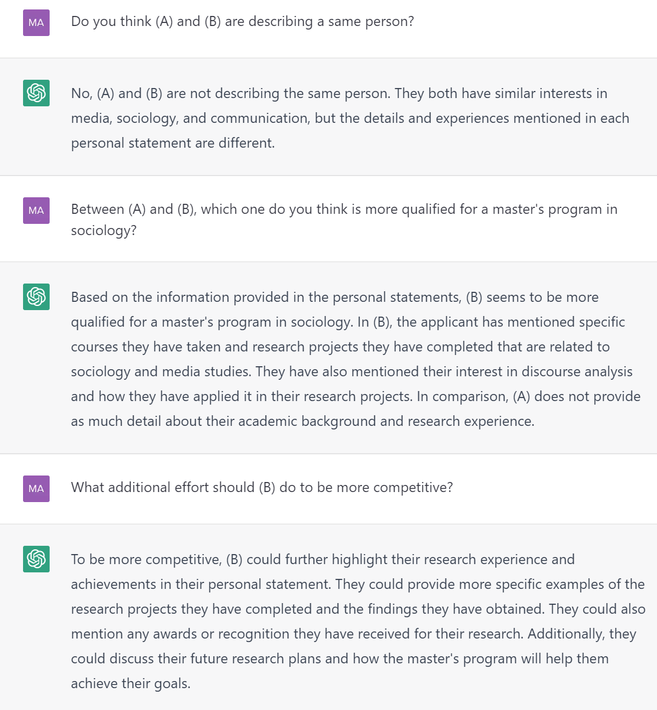

- 前置[[llm-prompting-basics]]
- ChatGPT会记住Thread中前面的信息。
  - 你可以通过点击左边的"new chat"来清空记忆 [[refresh]]
- 下面是一些具体的记忆信息的例子：
  - 应用场景：修改个人陈述，缩短文章等
  - 首先，输入"Here is a personal statement, please commit it to your memory as (A)"，然后写一大段内容
    - 然后，输入"Here's another one. Please commit it to your memory as (B)"，然后再写一大段内容
    - 例如，你可以问：
    - 
  - 进阶技巧：如果全文太长，你可以将一小段内容记为(A)，再将另一段内容记为(B)，等等。例如：
    - 