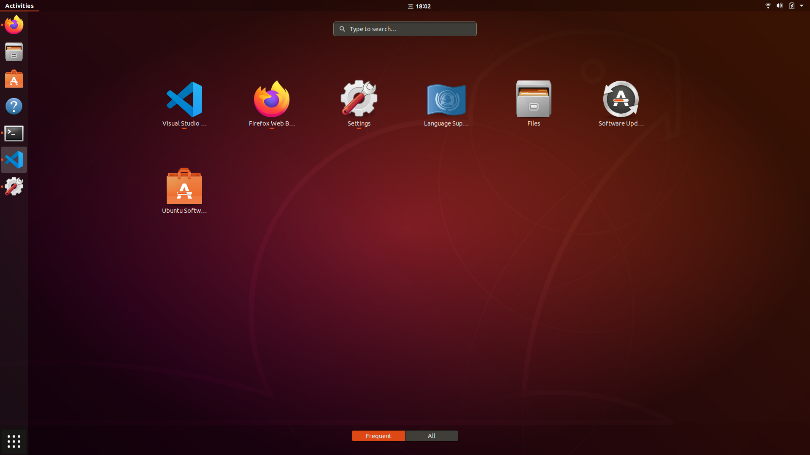
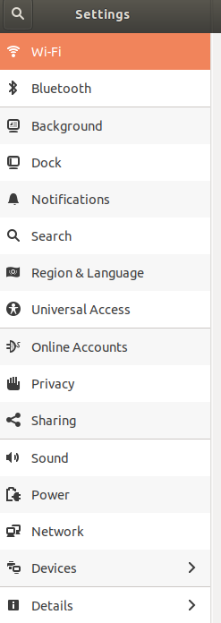

[toc]
## basics
Using [[u-disk-boot]], at [[grub-menu]] you could choose `Try...`
我们可以在这里先熟悉Ubuntu系统
这种live系统基本上具有正常系统的功能，上网，装轻量级软件，恢复备份都没有问题
Could serve as some [[temp-solution]]s.
## 资源管理器和网络
- 桌面左边一排是最常用软件
  - 比如第二个Firefox浏览器，第四个资源管理器等
- 左下角九宫格，点进有更多软件
  - 其中可以搜索（有时上下滚动也找不着你要的软件，那就要搜索）
  - 设置也在里面(可能需要滚轮翻页)
- Settings - Wi-Fi设置无线网或Network设置有线网

    - 设置好后火狐可正常上网
    - 比如我现在就在用Ubuntu火狐上博客编辑文章, record current progress as markdowns.
## 语言和输入法
`Try...` slightly differs from a normal Ubuntu system, ref: [[ubuntu/language]]
But mostly the same.
## 常用快捷键
- `Ctrl + Alt + T`打开终端，终端处`Ctrl + Shift + T`在同一路径同一窗口增加一个终端标签（这样多个终端放到一个窗口省空间）
- `Prtsc`获取全屏幕截图并保存到`Pictures`（文件管理器能看到）
`Shift + PrtSc`：某个区域。`Alt + PrtSc`：当前窗口。
- 如果不是要保存，而是要到剪贴板，那么再多按`Ctrl`. 例如`Ctrl + Shift + PrtSc`非常常用
  - very convenient along with [[paste-images-from-clipboard]]
- 九宫格 - Settings - Devices - Keyboard有快捷键列表。其中`Super`相当于Windows下的`Win`. 这里最常用的快捷键：
	- `Super` + `Page Up`切换工作空间
	- `Shift` + `Super` + `Page Up`移动窗口到不同工作空间
	- `Super` + 方向键移动窗口到一侧或者最大化/还原
	- `Super ` + `Space`切换输入法, **differs from windows**
- 单击`Shift`在中文输入法切换中英文。
- 一般地方的复制粘贴还是`Ctrl` + `C`，`Ctrl` + `V`，但终端之中，是`Ctrl` + `Shift` + `C`和`Ctrl` + `Shift` + `V`
	- 特别注意终端`Ctrl` + `C`是终止当前在跑的东西。新手会无数次被坑。
- 终端中上下键可以调出历史运行的命令，并直接可在其基础上修改。