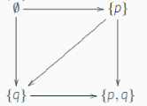
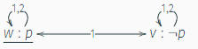

模态逻辑相比普通的，增加一些运算符（可能一元、多元、有序、无序等等）
- 最简单的：增加一元运算符$\Box$表示“必然”，$\Diamond$即$\neg \Box\neg$表示并非必然并非，即“可能”
- 更复杂的例子：知识逻辑，$\mathcal K_i$表示$i$知道
- 应用例子：$[\pi]$（“程序$\pi$保证”）

语义
- Kripke克里普克模型
  - $W$非空集合（一系列可能世界/状态）
  - $R$是$W$上二元关系（$w_1Rw_2$表示$w_2$是$w_1$可能的一个“替代世界”）
    - 常常有向图表示关系$R$，比如
    - 用图表示关系的具体例子
      - $p$成立但1不知道，2知道
      - 2张图重叠起来画
      - 
      - 这个关系是“不可区分”关系，不知道哪个是真实世界。该关系具有自反、对称、传递性
    - 实际应用：博弈树，状态机，小于等于关系等。所以各个学科都可用
  - $V$：每个世界中的真值表
- $\models$定义在模型$\mathcal M$和世界$w$上，即必须写$\mathcal M,w\models\cdots$，确定了世界才有真假！
  - 对于单个世界，$\neg,\wedge$等语义都很简单，就是这个世界中的正常的命题逻辑语义
  - $\mathcal M, w\models \Box \phi$要求对所有$wRv$的$v$都有$\mathcal M, v\models\phi$
    - 谈恋爱时是不是可以拿这个说土味情话，就是无论哪个平行世界，都……
  - 举例$\mathcal M, w\models \Diamond \phi$就是存在一个$wRv$的$v$使得$\mathcal M,v\models \phi$

有效性和框架
- 反正都是一些“任意”
- 以下三个，加上普通的$\mathcal M,w\models \phi$，共同构成2*2的表格
  - 任意赋值$V$都为真称为“点框架”有效$\mathcal F,w\models \phi$
  - 接上，进一步任意“点”$w$处有效则框架有效$\mathcal F\models \phi$
  - 任意“点”$w$处有效则模型有效$\mathcal M\models\phi$（注意模型对应的是某个赋值$V$而不是任意赋值）
- 框架$\mathcal F$的集合$\mathbb C$中所有框架都$\models \phi$就$\mathbb C\models \phi$
- 所有框架都$\models \phi$就$\models \phi$

框架的例子
- 框架只有$W,R$，不指定$V$
- 比如指定有两个世界$W=\{w_1,w_2\}$，$w_1Rw_1,w_2Rw_2$
- 那么$\mathcal F\models\Box p\to p$
- 更深刻地，框架上某些公式的成立往往等价于框架（特别是关系$R$）具有某些性质（如刚刚例子：关系$R$自反）。关系的性质在数学等学科用处很大