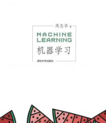

这个文件夹放的是 #读书笔记
著名的机器学习“西瓜书”（周志华）
- 封面 
- 书名：机器学习
- ISBN：978-7-302-42328-7
## 序言
- 符号 -> 统计
  - 理论到实践？
- 一些问题
    1. 符号学习会没嘛？以后会结合吧……
    2. 统计学习独立同分布假设？迁移学习！
    3. 深度学习：实践很有用，在打压统计学习
    4. 其他数学分支？微分几何在流形学习，微分方程在归纳学习。但只是配角。代数：基础工具
    5. 离散和连续？流形学习中李群李代数是个好例子。但很多人只是凑热闹
    6. 大数据的影响？更需要统计。是否有本质变化？
## 符号表（看一眼吧）