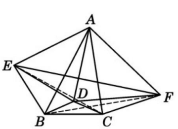
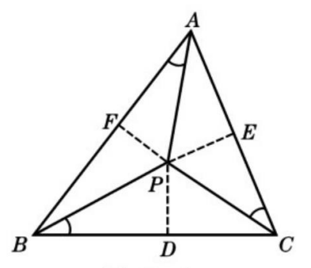

[toc]
# sin
- 正弦定理
- $sinA/a=sinB/b=sinC/c$
- [[齐次性]]，例如等式两侧$sinA,sinB$同时变成$a,b$
# cos
- 余弦定理
- $a^2=b^2+c^2-2bccosA$
- $cosA = \frac{b^2+c^2-a^2}{2bc}$
- 分子分母[[齐次性]]
# 三角形面积公式
- $2S=absinC=bcsinA=acsinB$
  - 来源：$S=\frac {ah}2,h=bsinC$
- 和[[trigonometric-in-triangle#cos]]里的$bccosA$有一定关系，注意不要混淆
  - 推论$\frac{2S}{(a^2+b^2-c^2)/2}=tanC$
## 海伦公式
- $4S^2=a^2b^2(1-cos^2C)=a^2b^2-\frac {(a^2+b^2-c^2)^2}4=\frac{2a^2b^2+2a^2c^2+2b^2c^2-a^4-b^4-c^4}4$
- $S^2=\frac{2a^2b^2+2a^2c^2+2b^2c^2-a^4-b^4-c^4}{16}$
- $s:=\frac{a+b+c}2$
- $S=\sqrt{s(s-a)(s-b)(s-c)}=\sqrt{\frac{a+b+c}2\frac{a+b-c}2\frac{a-b+c}2\frac{-a+b+c}2}$
- 验证：$(a+b+c)(a+b-c)(a-b+c)(-a+b+c)=(a^2+b^2-c^2+2ab)(c^2-a^2-b^2+2ab)=4a^2b^2-(a^2+b^2-c^2)^2$
- 推论：结合[[trigonometric-in-triangle#sin]]得到
  - $D(三角形外接圆直径):=a/sinA=b/sinB=c/sinC=abc/2S=\frac{2abc}{\sqrt{(a+b+c)(a+b-c)(a-b+c)(-a+b+c)}}$
# 内角和
- $A+B+C=\pi$
- $sinC=sin(A+B)$，结合[[trigonometric-equalities#和角公式]]等
- 结合“锐角”“钝角”等，可得$A=\pi-B-C>\pi/2-C$等不等式
# 例0
- 问题
    - 
    - 锐角$\triangle ABC,\angle A<45\degree$，$D$在三角形中，$\angle D=4\angle A, BD=CD$，$E,C$关于$AB$对称，$B,F$关于$AC$对称
    - 证明$AD\perp EF$
- 思想
  - [[reduction#到已知量]]。使用各种等量代换
    - [[trigonometric-in-triangle#sin]]
    - [[trigonometric-in-triangle#cos]]
  - [[齐次性]]
- 过程
    - 设$E$到$AD$垂足$E_1$
    - 设$F$到$AD$垂足$F_1$
    - $EF\perp AD\Leftarrow E_1=F_1\Leftarrow AE_1^2-DE_1^2=AF_1^2-DF_1^2\Leftarrow AE^2-DE^2=AF^2-DF^2$
    - $BD=CD=d=a/2sin2A,惯例设a,b,c,则只需b^2-a^2-d^2+2adcos\angle EBD=c^2-a^2-d^2+2ad cos\angle FCD$
    - $\Leftarrow \frac{b^2-c^2}{a^2}sin2A=cos(2C-\frac \pi 2+2A)-cos(2B-\frac \pi 2+2A)$
    - $=sin(2C+2A)-sin(2B+2A)=2cos(C+B+2A)sin(C-B)$
    - $\Leftarrow (c^2-b^2)sinA=a^2(sinCcosB-sinBcosC)$
    - [[齐次性]] $\Leftarrow (c^2-b^2)a =a^2(\frac{c(a^2+c^2-b^2)}{2ac}-\frac{b(a^2+b^2-c^2)}{2ab})$，成立！
# 例1
- 问题
  - 
  - 三个标出的角相等为$\alpha$，证明$cot\alpha = cotA+cotB+cotC$
- [[reduction#到已知量]]
  - 用尽可能少的字母表示
  - 并注意角度等量关系$\angle APB = \pi - \alpha-\angle ABP=\pi-B$
  - 需要表示的量
    - $A,B,C,a,b,c,\alpha$
    - $PA,PB,PC$记为$x,y,z$
- 第一步：[[symmetry#轮换]]
  - $y^2=c^2+x^2-2cxcos\alpha$等，三个式子出现一致的$cos\alpha$
  - 现在关键是利用[[symmetry#轮换]]，消掉$x,y,z$，相加得到
  - $a^2+b^2+c^2=cos\alpha (2c^2\frac{sin(B-\alpha)}{sin\angle APB}+\cdots)=2cos\alpha(c^2 \frac{sinBcos\alpha-cosBsin\alpha}{sinB}+\cdots)=2(c^2cos^2\alpha-c^2sin\alpha cos\alpha cotB\cdots)$
- 然后暴力化简
  - $c^2(cos2\alpha- Dsin2\alpha \frac{a^2+c^2-b^2}{2abc})+\cdots=0$
  - $cot2\alpha = \frac{D(a^4+b^4+c^4)}{2abc(a^2+b^2+c^2)}$
  - 根据单调性，反过来设已知$cot\alpha = \frac{D(a^2+b^2+c^2)}{2abc}$，则根据二倍角公式$cot2\alpha = \frac{cot^2\alpha - 1}{2cot\alpha}=\frac{D^2(a^2+b^2+c^2)^2-4a^2b^2c^2}{4abcD(a^2+b^2+c^2)}$
  - 结论是交叉相乘只需证明$2D^2(a^4+b^4+c^4)=D^2(a^2+b^2+c^2)^2-4a^2b^2c^2,D^2(a^4+b^4+c^4-2a^2b^2-2b^2c^2-2a^2c^2)=-4a^2b^2c^2$
  - 回忆[[trigonometric-in-triangle#海伦公式]]$D^2=a^2b^2c^2/4S^2=\frac{4a^2b^2c^2}{2a^2b^2+2a^2c^2+2b^2c^2-a^4-b^4-c^4}$得证