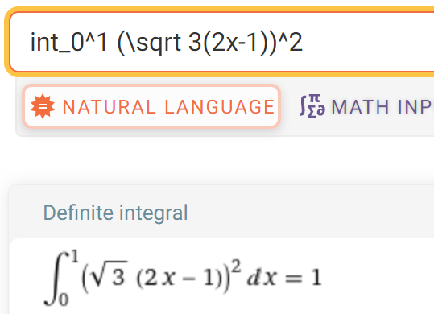

- 是找到[[orthogonal-decomposition]]的方法，相当于一种[[construction]]
- 例子
  - 对$1, x$ [[schmidt]]
  - $\langle f,g\rangle:=\int_0^1 fgdx$
  - $\alpha_1=1$
  - $\alpha_2 = \frac{x-1/2}{模长}=\frac{x-1/2}{\sqrt{1/12}}=\sqrt 3(2x-1)$
  - 验算时：可用 [[web-page-tools]] 求积分
  - https://www.wolframalpha.com/
  - 