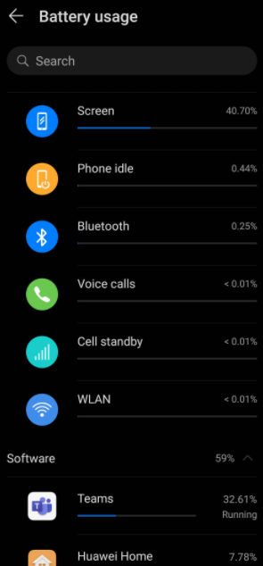
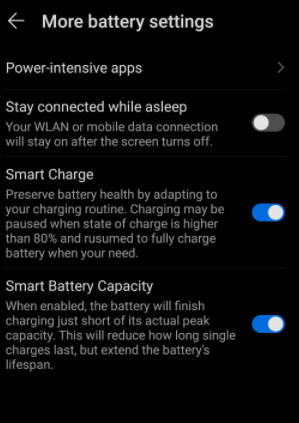
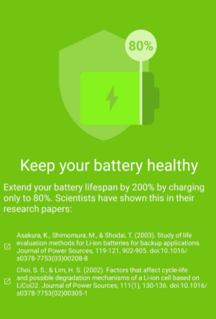
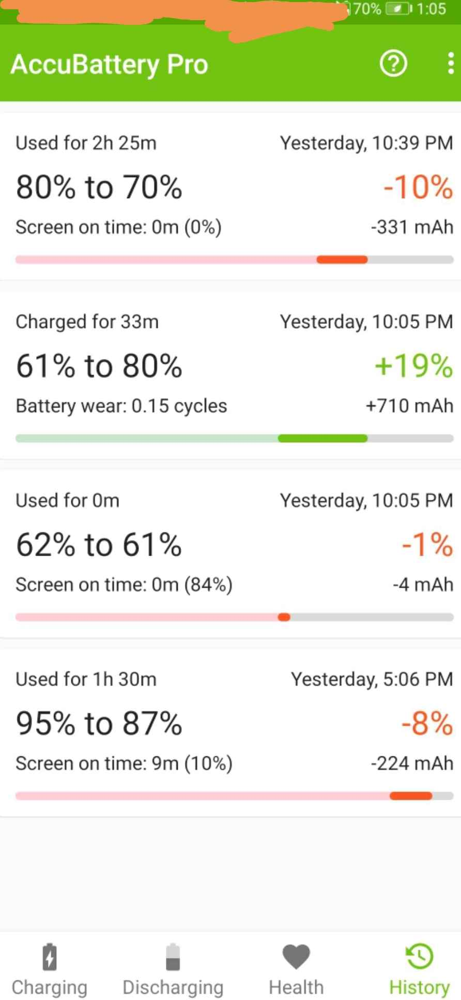

## 如何省电
- 尽量多待机不动，电量消耗和不待机完全不是一个数量级
- 设置的battery相关部分找usage等字眼，看到哪些硬件软件耗电占比多，针对性处理
  - 典型结果
  - 上面结果中，针对硬件可调低[[brightness]]（关闭自动亮度），减少亮屏
  - 针对软件可在不需要时关闭耗电大户的后台运行（参考[[optimize]]）
- 设置里专门找power saving mode和ultra power saving mode等字眼
  - 有些版本的ultra power saving mode是只能打电话发短信等
  - 有些版本更加灵活，可以自己指定“只有哪些应用可以用”，比如微信、支付宝
- ultra power saving mode实际应用场景示例
  - 出门剩一点点电应急，开ultra power saving mode只允许微信运行
  - 扫单车时开启位置、网络和蓝牙，扫完马上关
  - 拿快递柜快递时开启位置、网络，拿完马上关
  - 付钱时开启网络，付完马上关
  - 等等
## 如何延长电池寿命
- 参考[[devices/battery]]
- 设置Battery的角落里可能有80%或接近满时暂停的选项，如图
  - 这里只是暂停，没法保证，也没法灵活调节todo
  - 而且也不是所有品牌手机都有
- 所以可以使用相关App，如AccuBattery
  - 
  - 给予适当权限和信任
    - 如应用使用情况`usage`等）
    - [[optimize]]允许后台运行
      - 否则
      - 可以看到没有正常记录$87\% \Rightarrow 62\%$的所有部分
      - 设置不被杀后可以正常记录了（图中$80\%\Rightarrow 70\%$）
  - 上网查你的手机型号的标称电池容量，写到designed capacity处
  - 就可以查看用电情况、电池健康，并到一定阈值震动响铃提醒拔电
  - 其不能自动停止充，只会震动响铃提醒
  - 用其估计电池健康水平
    - [参考](https://accubattery.zendesk.com/hc/en-us/articles/209507189-Tab-3-battery-health-screen)
    - 这也要允许后台运行
    - 多些优良数据点（举例：从15%充到超过100%）才能获取可靠的测试结果
    - 刚开始数据点太少可能根本没法给出任何结果
## 其它
- 冷天出门，手机的实际可用电量会低很多
  - 出现的有两种现象：显示10%，实际上可能还有30%. 或者显示30%突然关机了
  - 哈哈，联想[[exception-warning]]，说明第二种处理方式显然比较不好