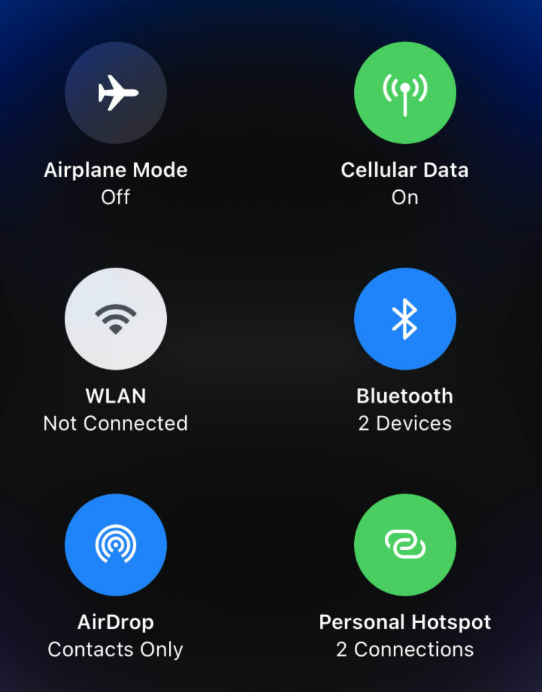

- 前置[[hotspot]]
# [[bluetooth-basics]]
- 默认可能只能[[bluetooth-basics]]连，不能wifi连，和安卓不同
  - 需要wifi连可能需要设置
- 且集成到[[apple-shortcut]]时可能只能[[bluetooth-basics]]连
- 用法
  - 参考[[bluetooth-basics]]，用iPhone点击连接其它手机/电脑（蓝牙配对），配对时对方可能要确认
# troubleshooting
- 只打开hotspot按钮可能仍然无法发现，需要长按按钮再打开“锁链”图标
- 