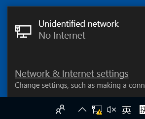
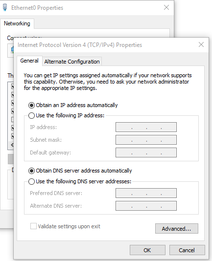

https://blog.csdn.net/Asukaaaa/article/details/83341075
# dns污染
- 排查网络故障时，如果域名不通，ip通，就要检查dns！
  - 例如中国防火墙墙[[github]]就是这样（2023.3），被“污染”
  - 能翻墙的[[proxy-basics]]和不被污染的dns往往是单向推出关系，即你可以翻墙，那么自然就会使用正常的dns服务器
    - 除非你在用公司内网，[[vpn]]等等
- 表现：比如
  ```text
  kex_exchange_identification: Connection closed by remote host
  Connection closed by 20.248.137.48 port 22
  ```
  - 这个ip不对
  - 参考[[hosts]]
  - [参考这里查正确ip](https://ipaddress.com/website/github.com)
# dns解析
- linux
  - `/etc/nsswitch.conf`定顺序
  - `/etc/resolv.conf`表示一般去哪里解析（比如`114.114.114.114`）
  - `/etc/hosts`手动解析
    - 如`bilibili.com`解析成`127.0.0.1`防止摸鱼
    - 比如[[hosts]]作翻墙的[[temp-solution]]
- windows
  - 
  - Network & Internet settings - Change adapter* - 单击图标 - 上方出现菜单栏选Change settings* - 选择条目IPv4 - Properties
  - 
- ios
  - 可能只有wifi状态才能改dns