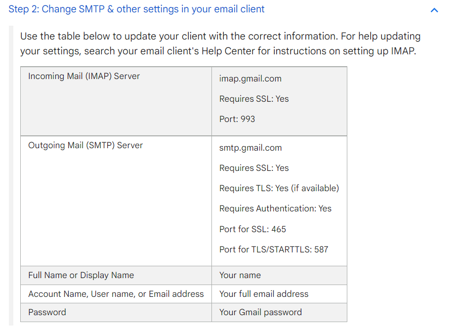

- 主要用于管理邮件
- 可以添加多个邮箱，统一管理
  - 当然，添加一个就要输入相应一个的密码
  - 添加完后左侧可以看到多个邮箱及相应的分栏（收件箱、已发送……等等），和网页版是对应的
- 可以添加什么邮箱？
  - 不一定是微软邮箱（`@microsoft.com, @outlook.com`）
  - 其它邮箱，只要开启了对应服务就可以用outlook代收
  - 例如qq邮箱，gmail等都需要设置开启相应服务。qq邮箱[参考](https://support.microsoft.com/zh-cn/office/%E5%B0%86-qqmail-%E5%B8%90%E6%88%B7%E6%B7%BB%E5%8A%A0%E5%88%B0outlook-34ef1254-0d07-405a-856f-0409c7c905eb)
  - 且在添加时outlook中也要做对应设置。比如gmail设置中给出了指示如图
  - 
- 有快捷键：如`Ctrl+A`全选，`Delete`删除，`Shift+Delete`永久删除，`Ctrl`多选等，非常方便