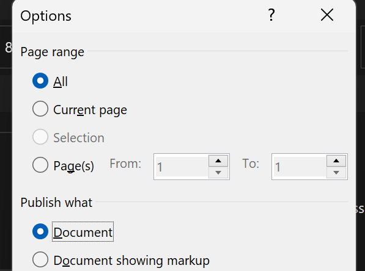

# [[region-language]]
- 如果用英文版office，就没有“五号字”这种东西，需要[中文字号对照数字](https://www.jianshu.com/p/e8d263efe7f7)
# print to pdf
- Ctrl + P 打印，打印成pdf，实质上是[[file-format#格式转换]]方式
# 另存为
- 例如另存为`.pdf`，相比print pdf有时能解决一些问题，也是[[file-format#格式转换]]方式，参考[[workaround]]
# 页眉页脚
- 在相应区域右键
- 
# 脚注
- 如图 
- 注意这个图标  处可以选择格式，例如使用圈数①，是否每页重新编号等
- 编辑脚注
  - 复制正文时，脚注可能自动带上，如贴给 grammarly时
  - 默认字数统计一般是不忽略脚注的。想忽略：上方Review-Word Count
# 快捷键
- `Ctrl+Shift+C`和`Ctrl+Shift+V`复制粘贴格式（即“格式刷”）
# 侧边批注comments
- 选中文字右键comments
- 复制时也类似脚注可自动带上
- [[word#print to pdf]]默认带上
- 上方Review - Show Comments，可以不显示
- [[word#另存为]]时可以选择转pdf时是否显示 