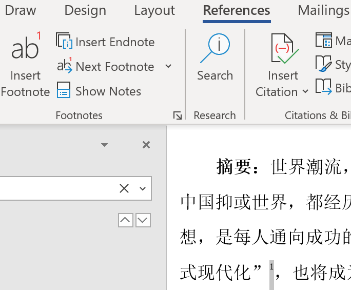

- 如果用英文版office，就没有“五号字”这种东西，需要[中文字号对照数字](https://www.jianshu.com/p/e8d263efe7f7)
  - 参考[[region-language]]
- 页眉页脚：在相应区域右键
- 脚注
  - 如图 
  - 注意这个图标  处可以选择格式，例如使用圈数①，是否每页重新编号等
  - 编辑脚注
    - 复制正文时，脚注可能自动带上，如贴给 grammarly时
    - 默认字数统计一般是不忽略脚注的。想忽略：上方Review-Word Count
- 快捷键
  - `Ctrl+Shift+C`和`Ctrl+Shift+V`复制粘贴格式（即“格式刷”）