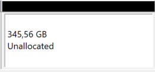

本篇是基于Win10装Ubuntu18.04. 其它系统操作中，有些是类似的。
# Windows+Ubuntu双系统安装

参考资料：https://www.cnblogs.com/xlpc/p/12324535.html
tags: #双系统 #Linux #Windows10

1. 参考[[hard-disk-win10]]，腾出unallocated的磁盘空间（注意并**不是**单独给个`Ubuntu (E:)`分区这个意思，而是要腾出成“黑色”如下图）

推荐100GB空间起步
2. 检查自己的BIOS模式
   `win+R`，输入`msinfo32`并运行
   看到BIOS模式（新电脑基本都是UEFI）
3. 下载需要安装的系统镜像并[[制作U盘启动盘]]
4. 插入U盘启动盘，重启电脑[[进入BIOS]]，在boot manager里将secure boot设置为disabled，并选择boot设备为U盘，保存退出
   1. 注：由于型号不同，选择boot设备为U盘的具体操作可能不同。有的是调整优先级使得U盘排第一，有的是直接选择U盘。
5. 重启后进入ubuntu安装界面。一步步按照指示进行。其中分区参考[[双系统分区]]
## Troubleshooting
1. 在“安装类型”步骤出错：安装类型列表为空，如图。
   (图片来自网络)
   1. 按照https://blog.csdn.net/weixin_43644231/article/details/105944192
在BIOS中将SATA Controller Mode设置为AHCI模式。
   2. 之后为保证Windows系统能够运行，使用安全模式运行一次Windows系统，并重启，切换回ubuntu.
注：有些比较新的机型就没有这个问题，BIOS甚至找不到SATA选项。那就不用设，直接可以用
2. 没有进入安装界面，直接ACPI错误，花屏。这是独显 #GPU 的锅
   1. 如果是台式，可以直接把显示器接到集显，装好系统再配置独显驱动
   2. 如果没法这么做，就在**出现`Try Ubuntu`，`Install`等选项的那个界面**，根据界面下方提示，按小写`e`，进入编辑界面
   3. 在里面把某一行末尾的`---`改成`nomodeset`，然后根据下方提示按`Ctrl + X`或者`F10`继续安装
   4. 安装进入系统后，运行`sudo gedit /etc/default/grub`（或`sudo vim /etc/default/grub`）
   5. 找到`GRUB_CMDLINE_LINUX_DEFAULT=quiet splash`，改成`GRUB_CMDLINE_LINUX_DEFAULT=quiet splash nomodeset`，保存文件退出
   6. 运行命令`sudo update-grub`