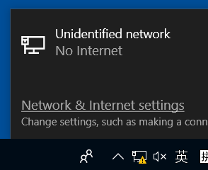
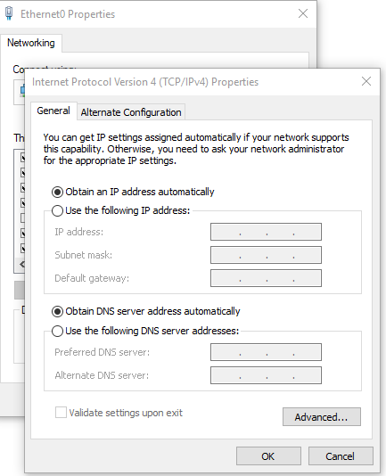

默认NAT模式一般都可以正常上网
有特殊需求可以[桥接模式](https://blog.csdn.net/qq_47354826/article/details/114888325?msclkid=9e162e53cf2c11ecac94f73dfa045b8c)
- 看上方文档。桥接模式既需要对VMware做某些全局设置，又需要对虚拟机自身做个别设置
- 注意中途需要重启网卡（也可以直接重启虚拟机）
  - windows重启网卡直接右键下图，关了再开即可
  - 
- 注意windows的修改ip，网关等的方法
  - 
  - Network & Internet settings - Change adapter* - 点图标 - 上方出现菜单栏选Change settings* - 选择条目IPv4 - Properties
  - 