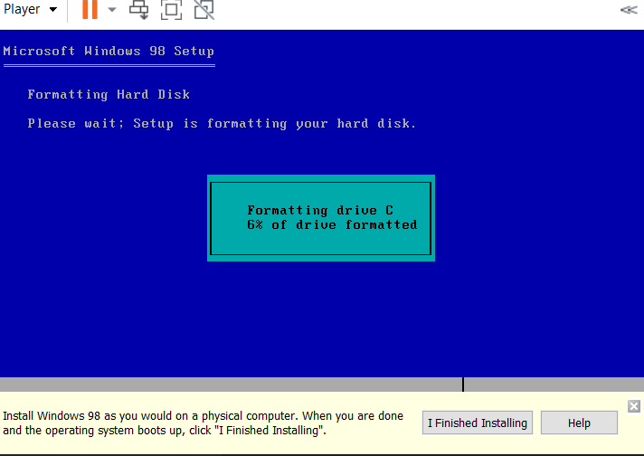

- 下载`.iso`文件（比如上[[internet-archive]]）
- VMWare中选择用iso新建虚拟机
  - 兼容性设置：USB 1.1
  - 内存128MB（不要信推荐的256MB，否则进不去安装界面）
  - 处理器不能多核多路
  - 参考https://jingyan.baidu.com/article/d7130635ce0a7a13fdf47594.html（不过不一定对。比如有些情况下反而不选virtualization能成功）

- 安装系统时，序列号：百度就有：WHWGP-XDR8Y-GR9X3-863RP-67J2T
- 安装VMWare Tools.
  - 任何时候，不要“硬拔”（宿主机强行拔）CDROM，否则可能直接蓝屏
  - 应当先在虚拟机拔了CDROM（右键eject）
    - 本来虚拟机里的CDROM是Win98系统的。现在要变成VMWare Tools的
  - 在宿主机窗口Player-Manage，安装VMWare Tools.
    - 这时需要虚拟机中操作安装过程
  - 最后：当安装完成时，宿主机VMWare默认想硬拔，不给它硬拔！虚拟机中手动拔即可防止系统蓝屏
  - 安装结束。现在虚拟机中控制面板可以看到VMWare Tools
    - 拖拽复制时如果报错，尝试看看小点的文件行不行，文件名改成纯ASCII行不行