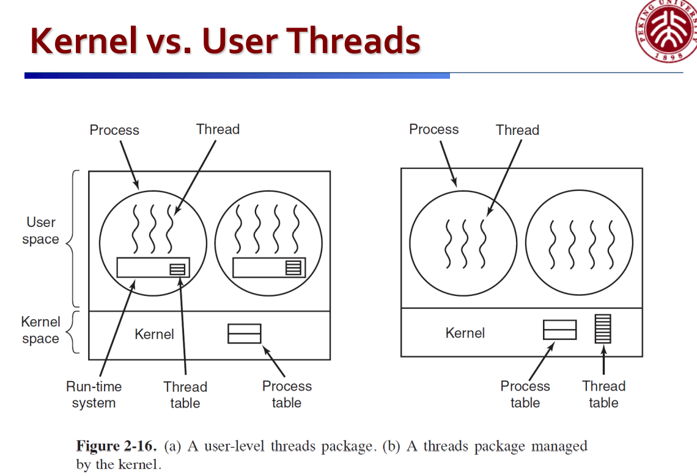

# 协程(用户级线程)
协程(Coroutine)是编译器级的控制单位，又称用户级线程(user-level thread),完全在用户态下进程内部实现调度。
对比：进程(Process)和线程(Thread, 准确来说为kernel-level thread)为操作系统级的控制单位，由os实现调度。

协程实现的是非抢占式的调度，即一个进程中包含多个协程，在这个进程被os调度的时间片内，进程内部的调度器调度某个协程运行，每个协程主动阻塞自身以让出cpu时间。

优势：减小线程调度开销与创建线程内存开销，减少同步加锁的开销