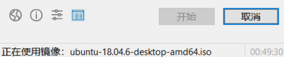

前置
- 准备安装Linux系统的电脑
- 16GB以上，没有其它有用信息的U盘

## 下载镜像
- 随便找一个镜像站，比如[阿里云](http://mirrors.aliyun.com/ubuntu-releases/18.04/)
==可能会随时间更新版本。目前显示18.04.6==
- 下载镜像
  - 需要桌面的下载带`desktop`字样的`.iso`
  - `server`没有GUI.
  - （当然`desktop`和`server`还有各自适合的默认环境配置和包等）
  - `amd64`表示64位（指的是amd发明的x86-64，并不是说amd处理器才能用）
## 制作启动盘
- 下载ISO mounting工具，例如http://rufus.ie/en/
  - 此处不妨选择portable哈哈哈，比较方便
- 插入16GB以上没有有用信息的U盘
- 直接双击绿色版rufus，选择设备（U盘盘符）以及镜像文件。其余设置默认即可。
  - **目前版本rufus无法对Ubuntu 18.04设置持久分区（重装系统时会报错）**，所以请不要用rufus设置持久分区
    - Google查是rufus的原因
    - 注：Google也给出了一些其它有用信息，比如一些其它工具可能可以正常使用持久分区。需要持久分区的自行搜索尝试换用即可
  - 持久分区（某种程度相当于“硬盘”）作用如下所示
> Put simply, a live disk allows you to run an operating system off of a removable storage device. This is done by downloading the OS' iso image directly from the creator and implementing it onto the USB as if it were a home computer. In our case, we just popped on over to Linux's download page and downloaded the LTS (long term service) version of Ubuntu totally free.
What makes this project special is that we are going to be creating live disks with persistent memory! This is to say that you'll be able to work on your flash drive's os and maintain some of the data from that session. This used to be a pain to get done but like plenty of things, it's been progressively made easier by lightweight software. (https://www.usbmemorydirect.com/blog/creating-your-own-linux-live-usb-with-persistent-memory/)

- 点击“开始”，然后等待写入完成
  - 完成之后安全弹出U盘
## 使用
- 开机进入bios，选择u盘对应[[efi]]，启动
- 用途
  - [[try-ubuntu]]
  - 装系统, e.g. [[dual-boot/steps]]
  - 作为[[temp-solution]]
    - 给主硬盘上系统恢复[[timeshift]]镜像
    - 调整主硬盘上[[partition]]
    - mount，查看和拷出主硬盘上文件（todo待确认）