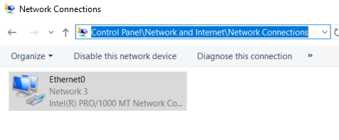

- 默认NAT模式一般都可以正常上网
  - 好处：主机换网，虚拟机啥也不用动。不需要手动设置ip，网关等等
- 有特殊需求可以[桥接模式](https://blog.csdn.net/qq_47354826/article/details/114888325?msclkid=9e162e53cf2c11ecac94f73dfa045b8c)
  - 比如[[wechat-tips]]中备份聊天记录需要手机电脑连同一个网，就必须桥接
- 设置桥接
  - 看[文档](https://blog.csdn.net/qq_47354826/article/details/114888325?msclkid=9e162e53cf2c11ecac94f73dfa045b8c)。桥接模式既需要对VMware做某些全局设置，又需要对虚拟机自身做个别设置
  - 注意中途需要重启网卡（也可以直接重启虚拟机）
    - windows重启网卡直接右键下图图标，关了再开即可
    - 
    - 在哪里找？上方地址栏有。进控制面板后输入上面的地址即可（不是在资源管理器输入）
  - windows的修改ip，网关，[[dns]]等的方法，参考[[dns]]
  - 当然桥接改回NAT，上面的都要改回来
- 一个有趣现象：对于连wifi要登录的情况，如果虚拟机开着，会首先捕捉到，造成麻烦。所以需要登录wifi时请暂停虚拟机