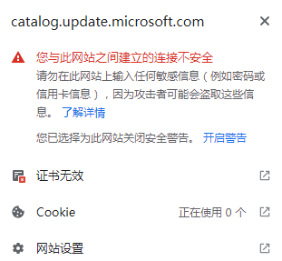
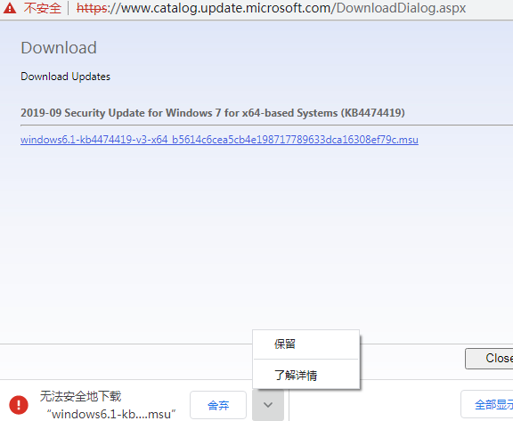
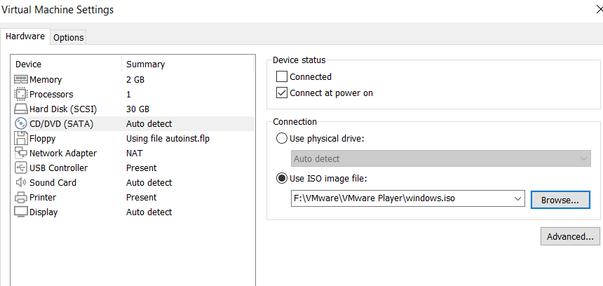
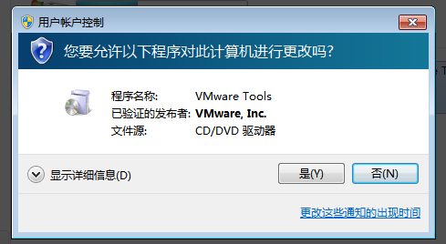

## 下载镜像
- 有个很好用的[工具站点](https://msdn.itellyou.cn/)可以下载win系统镜像
- 其中`ed2k`链接可以用
  - 迅雷
  - QQ - 腾讯微云，新建离线下载
  - 2023.1 [[baidu-net-disk]]用不了了
- 我们要
  - `ed2k://|file|cn_windows_7_professional_with_sp1_x64_dvd_u_677031.iso|3420557312|430BEDC0F22FA18001F717F7AF08C9D5|/`
  - 因为需要SP1才能用VMWare Tools
  - 截至2022.2.2，微软停止支持Win 7，做得很绝，自动更新不给装SP1
  - [[dont-trust-others]]
## 安装过程
序列号百度搜。比如
`KH2J9-PC326-T44D4-39H6V-TVPBY`
[[vmware]]新建虚拟机选择读取镜像
过程中可能需要点进去按回车（此时`Ctrl+Alt`释放鼠标到虚拟机外）
## 补丁
- 即使有了SP1还不够
  - 还要在虚拟机中，手动打上两个补丁，否则VMWare Tools用不了
  - 参考：[VMWare官方回答](https://communities.vmware.com/t5/VMware-Fusion-Discussions/VMWare-Tools-fails-to-install-Windows-7/td-p/2313675)
- chrome
  - IE和微软沆瀣一气，不给你访问下面两个网页
  - 请先用IE下载Chrome
  - 这是[[bootstrap]]过程
- URL：
  - 必须输入下面的
  - http://catalog.update.microsoft.com/v7/site/search.aspx?q=kb4474419
  - https://catalog.update.microsoft.com/v7/site/search.aspx?q=4490628
  - 它会自动跳转，但是你不能直接输入自动跳转后的URL
- Chrome也在给你处处设置障碍不给你下载
  - 可能显示证书无效。自己去“高级”里面手动信任它就行
    - 
  - 下载不会自动开始。请手动右键另存为
  - 下载完手动保留
    - 
## vmware tools安装
- 根据跳出提示，可能需要手动安装。即手动选择CD/DVD加载vmware安装目录处提供的vmware tools的`.iso`镜像，如图
- 虚拟机中手动选择光驱，并安装

- 终于可以拖拽复制文件了