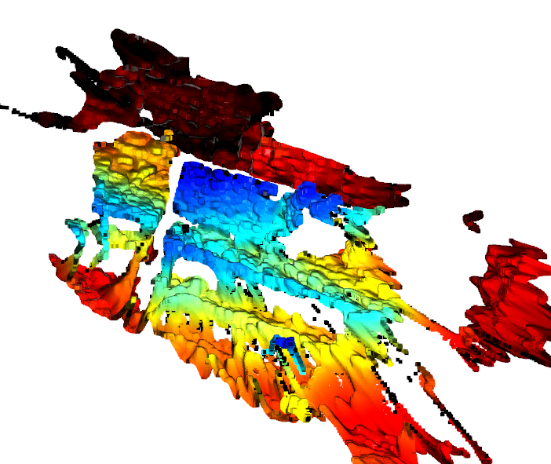

https://blog.csdn.net/weixin_43486780/article/details/108578048
我们先得到`.ply`文件，比如[[python-wrapper]], [[get-pointcloud]]那边得到的`1.ply`
`pip install open3d`
然后`python`中
```python 
import open3d as o3d
pcd = o3d.io.read_point_cloud('name.ply')
o3d.visualization.draw_geometries([pcd])
```
即可看到效果
懒人版：结合[[python-wrapper]]，在连接着realsense（并activate指定环境，有指定包）时可以直接
`cd <path/to/>python-examples`
`python export_ply_example.py; python -c "import open3d as o3d; o3d.visualization.draw_geometries([o3d.io.read_point_cloud('1.ply')])"`
出来窗口中鼠标拖拽和滚轮可以操作
这里默认着色策略是蓝色最近，暗红最远
这样得到的raw点云质量很差，比如，你能看出中间蓝色那个是个显示器吗？