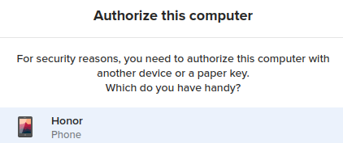

https://keybase.io/
[文档](https://book.keybase.io/)
# 优缺点
- 相比[[telegram]]好处
  - 时至2022.4还不用[[proxy-basics]]
  - [[general-principles/account]]不用手机号邮箱
- 相比[[wechat-tips]]好处
  - 不会监测和删除你的东西
  - 在linux可原生使用
  - [[file-transfer]]
    - 多平台可同步记录，也能同步删除
      - 新设备进来就能同步所有聊天记录
      - 无限期无痕迹撤回
      - 无限期**有痕迹**修改
    - 能发大文件，不压缩图
    - 能发比微信长得多的文本不截断
    - 作为手机电脑的文件传输助手，非常方便
  - 安全的增加、减少能access信息的平台
    - 比如临时用一下实验室电脑然后取消掉
    - end-to-end encrypt所有东西，非常保密安全
    - 可以用git建私人[[other-hubs]]
    - 存密码等敏感信息
    - 
  - 有一些[[markdown-basics]]格式可以用
  - 可建立teams和channel
  - 爆炸信息功能（若干秒后自动删）
- 缺点
  - 不能实时音视频通话
  - 不能多选信息删除/转发
  - 曾经出过证书过期问题（20231231），[参考](https://github.com/keybase/keybase-issues/issues/4219)
    - [[dont-trust-others]]
# 安装和创建账号
- 安装是傻瓜式
  - [官网](https://keybase.io/)写得很清楚
  - linux命令
    ```sh
    curl --remote-name https://prerelease.keybase.io/keybase_amd64.deb
    sudo apt install -y ./keybase_amd64.deb
    run_keybase
    ```
- 创建账号[[general-principles/account]]非常的模块化，不强制要求一堆东西，这就非常爽
  - 不像很多国产软件必须手机号，也不像[[teamviewer]]之类的屑软件必须要手机啥的
  - 加密码：则可退出和下次登录
  - 再加手机或邮箱：则别人可通过这些找到你
  - 啥都不加也行。最小的sign up只需要给当前设备一个代号（例如`Linux Device`）
- 然而每个设备必须有一个代号，这方便之后加新设备
# 多设备（跨平台）
- 可以多设备传递文件、文字信息、图片等
- 示例：
  - 你先在手机登录（或注册）了，当时命名你的手机为`Honor`
  - 然后电脑登录时就选择用它验证
  - 根据提示操作即可（比如扫码）
    - 
- 删除revoke设备权限：之后不能访问
  - 即使删除，也不能再用相同名字
# 命令行
- https://book.keybase.io/docs/cli#basics
# troubleshooting
- 如果你电脑时间不对，需要联网同步时间，确保安全性，才能使用keybase
  - 比如win10的
# teams
- 相比微信群好处
  - 拉进来直接看到所有历史
  - 一个team有许多channel（通知、灌水etc）
    - 注意新设置channel后，其他人要join一下才能看到
    - 不同channel参见的人员可能不同，方便构建“内部小圈子”
- 有时候teams发不出东西但私发可以，原因未知（可能是网不好？）
  - 私发可能确实对网络负担小
# 操作
- 删除之前的记录：可能有延迟。特别是删除图片等
- 手机截图可能显示这是private content不给你截。你可以在手机设置里打开一个开关使得可以截
- 手机可以相册中选择上传多张图片
# 文件管理：左侧Files选项卡
- 类比[[net-disk]], [[file-transfer]]，保持隐私和持久化
- 
- 安装成功后可以类似[[net-disk]]一样拖动上传
- 在windows的`KBFS (K:)`中用[[file-explorer]]管理（[[CRUD]]方式和普通[[file-explorer]]中相同）
- 可以打开同步功能，就会在这个设备上同步
# [[git]]
- 是一种[[other-hubs]]
- `Ctrl+7`快捷键
  - 可以创建库[[init]]
    - 复制相应链接（`keybase://`开头）
    - 用于[[remote]]
  - 本地正常[[commit]] [[push-pull]]等
- 可以用于私人、[组队](#teams)等等
- 速度不会那么快，但
  - 可以作为[[net-disk]]的一个选择
  - 且不用[[proxy-basics]], [[dns#dns污染]]等处理（时至 202402）
- troubleshooting: 莫名其妙缺文件，[[windows-link]]一下就行，[参考](https://github.com/keybase/client/issues/15176#issuecomment-531444986)，注意是[[windows-cmd]]不是[[powershell]]